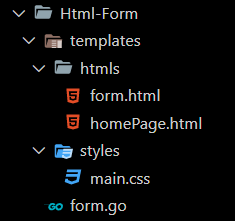
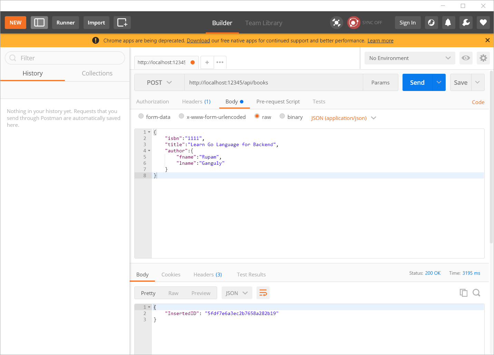
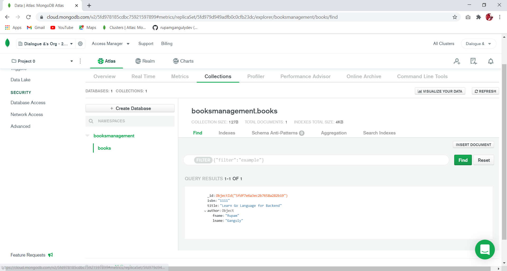

# Install GO LANG in WSL2 and Setup VsCode, Github

https://www.youtube.com/watch?v=1klNsw_kY2c&t=455s
# GO LANG NOTES by hiRupamGanguly:-
## INDEX:

|        |           |           |
| ------------- |:-------------:|:-------------:|
| [Why GoLang as Backend?](#Why-use-GO-Lang-as-Backend) | [Variabl and Loops](#VARIABLE-and-LOOP) | [FUNCTION](#FUNCTION) |  
| [Command line arguments passing](#ComandLine-Argument-Passing) | [Pointer](#POINTER) | [Structure or Class](#STRUCT) | 
| [Interface](#INTERFACE) | [Type-Assertion](#Type-Assertion) | [Mimic of Inheritance](#MIMIC-OF-INHERITANCE) |
| [Allocation](#Allocation) | [Array](#Array) | [SLICE](#SLICE) |
| [How to delete item from Slice](#Deleting-Element-From-Slice) | [MAP](#MAP) | [Why use POINTER in code](#Why-use-Pointer-in-code) |
| [STACK](#STACK) | [QUEUE](#QUEUE) | [Doubly-Linked-List](#Doubly-Linked-List) |
| [Some useful theory about Mongo and Mux Driver](#MonGo-And-GORILA-MuX-driver) | [Basic Gorila Mux project](#Gorilla-Mux-demo) | [Html Css Rendering wiyh GO Lang](#HTML-CSS-TEMPLATE-RENDERING) |
| [Interaction with Form Html](#Interact-with-Form) | [File-Upload Html Interaction](#File-Upload) | [MongoDB REST API CRUD](#REST-API-CRUD) |
| [MySQL REST API CRUD](#MySQL-REST-API-CRUD) | [CLean Code Architecture MongoDB-Rest-API:](#CLean-Code-Architecture-Rest-API) | [empty](#emptty) |


## Section 1 : 

### Why-use-GO-Lang-as-Backend
|  NodeJs v/s Go | Reddit Post  | Reddit Post  | Valorent's Backend  |
| :---:   | :-: | :-: | :-: |
|  |  |  |   |


## Section 2 : GO-Lang-Fundamentals:

	
### VARIABLE-and-LOOP 
Inside a function, the := short assignment statement can be used in place of a var declaration with implicit type.

~~var int i  // syntax error~~
```go
var i int // // SYNTAX IS CORRECT
//Here i is the name of the variable. Type of the variable is int. 

package main
import "fmt"
var packageLevelScope int =12 // this variable accessible from the main package
var GlobalLevelScope int =13 // this variable accessible from any packages
func main() {
	var blockLevelScope int=15 // this variable only accessible from main function
	k := 3 
	m, n, p, q := 1, 34.67, true, "i am string"
	// Outside a function, every statement begins with a keyword (var, func, and so on)
	// and so the := construct is not available.
	a:=10 // binary 1010
	b:=3  // binary 0011
	a&b   // 0010 -> 2
	a|b   // 1011 -> 11
	a^b   // 1001 -> 9
	a&^b  // 0100 -> 8

	i:=1
	for ;i<10; {
		fmt.Print(i)
		i++
	}  // 123456789
	fmt.Println("")
	fmt.Println(i)// 10

	j:=1
	for j<6{
	fmt.Print(j)
	i++
	}// 12345

	for k:=0;k<10;k++{
		if k%2==0{
			continue
		}
		fmt.Print(k)
	}// 13579


	for row:=1; row<=3;row++{
		for col:=1;col<=3;col++{
			fmt.Print(row,":",col," -> ")
			if row*col>=3{
				break 
			}
		}
	} // 1:1 -> 1:2 -> 1:3 -> 2:1 -> 2:2 -> 3:1 -> 


MyLabel:
	for row:=1; row<=3;row++{
		for col:=1;col<=3;col++{
			fmt.Print(row,":",col," -> ")
			if row*col>=3{
				break MyLabel
			}
		}
	} // 1:1 -> 1:2 -> 1:3 ->


	s:="Rupam Ganguly"
	for index,value:=range s{
		fmt.Print(index," :- ", value," -> ")
	}// 0 :- 82 -> 1 :- 117 -> 2 :- 112 -> 3 :- 97 -> 4 :- 109 -> 5 :-  32 -> 6 :- 71 -> 7 :- 97 -> 8 :- 110 -> 9 :- 103 -> 10 :- 117 -> 11 :- 108 -> 12 :- 121 ->


	s:="Rupam Ganguly"
	for index,value:=range s{
		fmt.Print(index," :- ", string(value)," -> ")
	} // 0 :- R -> 1 :- u -> 2 :- p -> 3 :- a -> 4 :- m -> 5 :-   -> 6 :- G -> 7 :- a -> 8 :- n -> 9 :- g -> 10 :- u -> 11 :- l -> 12 :- y -> 
 }

```
### FUNCTION

SIGNATURE of FUNCTION:

```go
func function_name (argument1 type, argument2 type) (return_type1, return_type2){
	return a,b
}
```
```go
package main

import "fmt"

func factorial(num int) int {
	if num > 1 {
		return num * factorial(num-1)
	}
	return 1
}
func anotherFunc() {
	fmt.Println("I am Another Function")
}

// Function as value - Anonymous function
var result = func(a, b int) int {
	return a + b
}

func main() {
	fmt.Println("Factorial of 4", factorial(4)) //Factorial of 4 24
	defer anotherFunc()                         //defer keword in GO makes a function execute at the end of the.
	// panic execute after defer :) I tell you Go is awesome.
	// You dont know about panic of goLang? feel free to google. ha ha ha...
	//execution (or when hits return statement) of parent function from where it is called.
	fmt.Println("HI I am MAIN and I execute first instead of defer function")
	fmt.Println("HI I am MAIN and I execute first instead of defer function")
	fmt.Println("HI I am MAIN and I execute first instead of defer function")
	fmt.Println("Calling Function as value - Anonymous function", result(6, 9))
	subtra := func(a, b int) int {
		return a - b
	}(89, 20)
	fmt.Println("Subtra is caling: ", subtra)
	defer fmt.Print("First	")
	defer fmt.Print("Second	")
	defer fmt.Print("Third	")

	// a:="start"
	// defer fmt.Print(a) // start
	// a="end"
	fmt.Println("Start")
	defer fmt.Println("This is defered")

	fmt.Println("End")

	panicker()
	fmt.Println("DONE the Main")
	panic("BAD THING HAPPENED")
	fmt.Println("I am ignored by the panic as recover() is not present for the last panic")
}
func panicker() {
	fmt.Println("About to Panic")
	defer func() {

		// synatax of another kind of if block use here:
		//  if intialization; condition{ body }
		if err := recover(); err != nil {
			fmt.Println("ERROR: ", err)
		}
	}()
	panic("BAD THING HAPPEN AGAIN")
	fmt.Println("DONE PANICKING")
}
```
#### OUTPUT
```shell
Factorial of 4 24
HI I am MAIN and I execute first instead of defer function
HI I am MAIN and I execute first instead of defer function
HI I am MAIN and I execute first instead of defer function
Calling Function as value - Anonymous function 15
Subtra is caling:  69
Start
End
About to Panic
ERROR:  BAD THING HAPPEN AGAIN
DONE the Main
This is defered
Third	Second	First	I am Another Function
panic: BAD THING HAPPENED

goroutine 1 [running]:
main.main()
	/tmp/sandbox739186246/prog.go:48 +0x607

```


### ComandLine-Argument-Passing
```go
package main

import (
	"fmt"
	"os"
)

func main() {
	if len(os.Args) != 2 {
		// If you’re wondering why we expect 2 arguments,
		// it’s because the first argument – at index 0 – is always
		// the path of the currently running executable.
		os.Exit(1)
	}
	fmt.Println("It's over", os.Args[1])
}
```
#### OUTPUT
```shell
PS E:\PROJECTS\BACKEND\gobackendcrud> go run demo.go
exit status 1
PS E:\PROJECTS\BACKEND\gobackendcrud> go run demo.go 1234
It's over 1234
PS E:\PROJECTS\BACKEND\gobackendcrud> 
```
### POINTER
```go
package main

import (
	"fmt"
)

func passedasReferencee(a *int) { // d is passed
	fmt.Println("*a is : ", *a)
	fmt.Println("a is : ", a)
	fmt.Println("address of a variable is: ", &a)
	fmt.Println("Incrementing:")
	*a++ // incrementing value - *a was 7 , now *a will be 8
	fmt.Println("*a is : ", *a)
	fmt.Println("a is : ", a)

}

func passedasvariable(a int) { // a is copy of c
	fmt.Println("a is : ", a)
	fmt.Println("address of a variable is: ", &a)
	fmt.Println("Incrementing:")
	a++ //a is incremented from 7 to 8
	fmt.Println("a is : ", a)
}


func main() {
	c := 7
	fmt.Println("in main function address of c is : ", &c)
	d := &c // d is memory address of c
	fmt.Println("in main function d is : ", d)
	fmt.Println("in main function *d is : ", *d)
	fmt.Println("passedasReferencee called:--->")
	passedasReferencee(d)
	fmt.Println("after executing function :- ")
	fmt.Println("c is : ", c)
	fmt.Println("d is : ", d)
	fmt.Println("*d is ", *d)
	fmt.Println("passedasVariable called:--->")
	passedasvariable(c) // here we passed c
	fmt.Println("after executing function :- ")
	fmt.Println("c is : ", c) // no change
	fmt.Println("d is : ", d)
}

```
#### 		OUTPUT:
```shell
	in main function address of c is :  0xc000012090
	in main function d is :  0xc000012090
	in main function *d is :  7
	passedasReferencee called:--->       
	*a is :  7
	a is :  0xc000012090
	address of a variable is:  0xc000006030
	Incrementing:
	*a is :  8
	a is :  0xc000012090
	after executing function :-
	c is :  8
	d is :  0xc000012090
	*d is  8
	passedasVariable called:--->
	a is :  8
	address of a variable is:  0xc000012098
	Incrementing:
	a is :  9
	after executing function :-
	c is :  8
	d is :  0xc000012090
```

### Go lang tries to distance itself from object-oriented terminology, at the same time it can give you all object-oriented programming flavors and benefits. For instance, C++ or Java classes are called a struct, A class methods are called receivers. Inheritance is called embedding
### STRUCT
```go
package main

import (
	"fmt"
)

type DataStruct struct {
	string
	bool
}
type Employee struct {
	firstname string
	lastname  string
	salary    int
	fulltime  bool
}
type myStruct struct{
	foo int
}

func main() {

	var ross Employee
	fmt.Println(ross) // {"" 0 false}
	ross.firstname = "Rupam"
	ross.lastname = "Ganguly"
	ross.salary = 45000
	ross.fulltime = true
	fmt.Println(ross) // {Rupam Ganguly 45000 true}
	bos := Employee{
		firstname: "Rintu",
		lastname:  "Ganguly",
		salary:    58000,
		fulltime:  true,
	}
	fmt.Println(bos) // {Rintu Ganguly 58000 true}
	mos := Employee{"my mosh", "ganguly", 90000, true}
	fmt.Println(mos) // {my mosh ganguly 90000 true}
	// Anonymous struct
	monica := struct {
		age     int
		salary  int
		teacher bool
	}{
		age: 12, salary: 12345, teacher: true,
	}
	fmt.Println(monica) // {12 12345 true}
	// Pointer Struct  -> i explained why we use pointer in code in letter section...
	pointerRoss := &Employee{
		firstname: "Rintu",
		lastname:  "Ganguly",
		salary:    58000,
		fulltime:  true,
	}
	fmt.Println(pointerRoss)                               // &{Rintu Ganguly 58000 true}
	fmt.Println(*pointerRoss)                              // {Rintu Ganguly 58000 true}
	fmt.Println("first name : ", (*pointerRoss).firstname) // first name :  Rintu
	fmt.Println(pointerRoss.firstname)                     // Rintu
	// DataStruct
	samp1 := DataStruct{"Monday time", true}
	fmt.Println(samp1) // {Monday time true}
	samp1.bool = false
	fmt.Println(samp1) // {Monday time false}
	samp2 := DataStruct{"Sunday", false}
	fmt.Println(samp2) // {Sunday false}
	samp3 := samp1
	fmt.Println(samp3) // {Monday time false}

	// Nested Struct
	type UpdatedEmployee struct {
		firstname string
		lastname  string
		salary    int
		fulltime  bool
		data      DataStruct
	}
	nestedstructMy := UpdatedEmployee{
		firstname: "Rintu",
		lastname:  "Ganguly",
		salary:    58000,
		fulltime:  true,
		data:      DataStruct{"new data inserted", true},
	}
	fmt.Println(nestedstructMy)             // {Rintu Ganguly 58000 true {new data inserted true}}
	fmt.Println(nestedstructMy.salary)      // 58000
	fmt.Println(nestedstructMy.data.string) // new data inserted

	var ms *myStruct
	ms=new(myStruct) // alternate syntax: ms=&myStruct{foo:42}
	(*ms).foo=42 // alternate syntax: ms.foo=42 // derefercencing
	fmt.Println((*ms).foo) // alternate syntax: fmt.Println((*ms).foo)
}
```
#### OUTPUT
```shell
{  0 false}
{Rupam Ganguly 45000 true}
{Rintu Ganguly 58000 true}
{my mosh ganguly 90000 true}
{12 12345 true}
&{Rintu Ganguly 58000 true}
{Rintu Ganguly 58000 true}
first name :  Rintu
Rintu
{Monday time true}
{Monday time false}
{Sunday false}
{Monday time false}
{Rintu Ganguly 58000 true {new data inserted true}}
58000
new data inserted
42
```

### INTERFACE

An interface is a collection of method signatures that a Type(struct) can implement (using methods). Hence interface defines (not declares) the behavior of the object
An interface is declared using the type keyword, followed by the name of the interface and the keyword interface. Then, we specify a set of method signatures inside curly braces.
Go Interface doesn’t have fields and also it doesn’t allow the definition of methods inside it. Any type needs to implements all methods of interface to become of that interface type.
To implement an interface, you just need to implement all the methods declared in the interface.

```go
package main

import (
	"fmt"
	"math"
)

// in order to successfully implemented an interface,
// we need to implement all the methods declared by the interface with exact signature
type Shape interface {
	// just a struct or class with only some function declaration....
	Area() float64
	Perimeter() float64
}
type AnotherShape interface {
	// just a struct or class with only some function declaration....
	NewArea() string
	NewPerimeter() float64
}
type Rect struct {
	// this is a stuct with only some undefined variables
	width, height float64
}
type Circle struct {
	// this is a stuct with only some undefined variables
	radius float64
}


// here(r Rect) says r is object of Rect class.. 
// actually here, this is the synatax of defining a function outside of a struct
// here we define Area function and Perimeter function of Shape Interfae inside Rect struct.. so that Rect class can implements Shape interface...
// I know syntax is funny.. but its very powerful.. in this one line compiler do lots of work
func (r Rect) Area() float64 {
	fmt.Println(r.width * r.height)
	return 7
}
func (r Rect) Perimeter() float64 {
	fmt.Println(2 * (r.width + r.height))
	return 7
}
// Now Circle class also try to implements Shape interface 
func (c Circle) Perimeter() float64 {
	fmt.Println(2 * (math.Pi * c.radius))
	return 7
}
func (c Circle) Area() float64 {
	fmt.Println(math.Pi * c.radius * 2)
	return 7
}

// Here Rect class again implements AnotherShape interface.. so Rect class implements 2 interfaces..
func (r Rect) NewArea() string {
	return "Implements multiple interfaces"
}
func (r Rect) NewPerimeter() float64 {
	return 9874321
}
func main() {
	var s Shape = Rect{10, 3}
	s.Area() // 30
	// multiple interface of Rect
	var ns AnotherShape = Rect{5, 8}
	fmt.Println(ns.NewArea())      // Implements multiple interfaces
	fmt.Println(ns.NewPerimeter()) // 9.874321e+06
	s = Circle{10}
	s.Perimeter() // 62.83185307179586

	//when Area() didnt implemented by c Circle then we get error:
	//cannot use Circle literal (type Circle) as type Shape in assignment:
	//Circle does not implement Shape (missing Area method)

}
```
#### OUTPUT
```shell
30
Implements multiple interfaces
9.874321e+06
62.83185307179586

```


### Type-Assertion

Findout the Type of Dynamic Value of an interface

```go
package main

import "fmt"

func explain(i interface{}) {
	switch i.(type) { // we pass type of i in switch, accroding to the type cases are happen
	case string:
		fmt.Println(" Interface has a String")
	case int:
		fmt.Println("Interface has a Int")
	default:
		fmt.Println("Interface has other Type")
	}
}  
func main() {
	explain("Rupam Ganguly")
	explain(45.987)
	explain(43)
}
```
#### OUTPUT
```shell
Interface has a String
Interface has other Type
Interface has a Int
```
### MIMIC-OF-INHERITANCE

composition relationship ["has a" relationship]: 

```go
// In GO we can use struct for inheritance, we can compose using structs to form other objects
package main

import "fmt"

type ParentClass struct {
	color      string
	background string
}

// thats how we define function of ParentClass outsude class/struct....
func (ParentClass) basFuncOne() string {
	return "I am Base Function ONE"
}
func (ParentClass) basFuncTwo() string {
	return "I am Base Function TWO"
}

type ChildClass struct {
	ParentClass
	style    string
	fontsize int
}


// thats how we define function of ChildClass outside class/struct
func (c ChildClass) childFunc() string {
	return "I am Child Function "
}
func main() {
	// Patent object creation
	baseObj := ParentClass{
		color:      "Black",
		background: "White",
	}
	// Child object creation
	childObj := ChildClass{
		ParentClass: baseObj,
		style:       "bold",
		fontsize:    32,
	}
	fmt.Println(childObj)    // {{Black White} bold 32}
	childObj.color = "Green" // childObj can access color backgroud fields of Base STRUCT
	childObj.background = "Red"
	childObj.fontsize = 16
	fmt.Println(childObj)              // {{Green Red} bold 16}
	fmt.Println(childObj.basFuncOne()) // childObj can access basFunc Function of Base STRUCT
	fmt.Println(childObj.basFuncTwo()) // I am Base Function ONE // I am Base Function TWO
	fmt.Println(childObj.childFunc())
}
```
#### OUTPUT
```shell
{{Black White} bold 32}
{{Green Red} bold 16}
I am Base Function ONE
I am Base Function TWO
I am Child Function 
```
### Allocation

Go has two allocation primitives, the built-in functions new and make. new is a built-in function that allocates memory, but unlike its namesakes in some other languages it does not initialize the memory, it only zeros it. 
That is, new(T) allocates zeroed storage for a new item of type T and returns its address, a value of type *T. 

```go
package main

import "fmt"

type myBox struct {
	index int
	data  int
}

func main() {
	obj1 := new(myBox)
	fmt.Println(obj1)  // &{0 0}
	fmt.Println(*obj1) // {0 0}
	var obj2 myBox
	fmt.Println(obj2) // {0 0}
	//fmt.Println(*obj2) // invalid indirect of obj2 (type myBox)
}
```
#### OUTPUT
```shell
&{0 0}
{0 0}
{0 0}
```
The built-in function make(T, args) serves a purpose different from new(T). It creates slices, maps, and channels only, and it returns an initialized (not zeroed) value of type T (not *T). The reason for the distinction is that these three types represent, under the covers, references to data structures that must be initialized before use. Example of make function is present in Slice section...

### Array

Basically, an array is a number of elements of same type stored in sequential order.

Once you declare an array with its size you are not allowed to change it.

If you try to insert more elements than array size, compiler will give you an error.

By default array size is 0 (zero)

Array index starts from 0th index

We can set value directly to array at particular index array_name[index]=value

The inbuilt len returns length of an array
```go
package main

import "fmt"

func main() {
	grades:=[...]int64{12,32,11,45}
	gradesssss:=[11]int64{12,32,11,45}
	fmt.Println(grades) // [12 32 11 45]
	fmt.Println(len(grades)) // 4
	fmt.Println(len(gradesssss)) // 1
	x := [12]int{1, 2, 3, 4, 5, 6, 7, 8, 9}
	fmt.Println(x) // [1 2 3 4 5 6 7 8 9 0 0 0]
	var y [12]int
	fmt.Println(y) // [0 0 0 0 0 0 0 0 0 0 0 0]
	y[5] = 45
	y[2] = 12
	fmt.Println(y) // [0 0 12 0 0 45 0 0 0 0 0 0]
	y[5] = 123
	fmt.Println(y) // [0 0 12 0 0 123 0 0 0 0 0 0]
	fmt.Println("length of y: ", len(y)) // length of y:  12
	for i := 0; i < len(y); i++ {
		fmt.Print(y[i], " - ") // 0 - 0 - 12 - 0 - 0 - 123 - 0 - 0 - 0 - 0 - 0 - 0 -
	}
	fmt.Println()
	for i := 0; i < len(y); i++ {
		fmt.Print(y[i]+x[i], " - ") // 1 - 2 - 15 - 4 - 5 - 129 - 7 - 8 - 9 - 0 - 0 - 0 -
	}

	var matrix [3][4]int
	matrix[0]=[4]int{1,2,3,4}
	matrix[1]=[4]int{5,6,7,8}
	matrix[2]=[4]int{9,10,11,12}
	fmt.Println(matrix)
}
```
#### OUTPUT
```shell
[12 32 11 45]
4
11
[1 2 3 4 5 6 7 8 9 0 0 0]
[0 0 0 0 0 0 0 0 0 0 0 0]
[0 0 12 0 0 45 0 0 0 0 0 0]
[0 0 12 0 0 123 0 0 0 0 0 0]
length of y:  12
0 - 0 - 12 - 0 - 0 - 123 - 0 - 0 - 0 - 0 - 0 - 0 -
1 - 2 - 15 - 4 - 5 - 129 - 7 - 8 - 9 - 0 - 0 - 0 - 

[[1 2 3 4] [5 6 7 8] [9 10 11 12]]

```
### SLICE

Slice is the same as an array but it has a variable length so we don’t need to specify the length to it. It will grow whenever it exceeds its size. Like an array, slice also has index and length but its length can be changed.

Slice also has continuous segments of memory locations

The default value of uninitialized slice is nil

Slices does not store the data. It just provides reference to an array

As we change the elements of slice, it will modify corresponding elements of that array

What go does is just create an array of size- Double the previous size of the array when the array is full
thats how slice achive it's dynamic nature.
So its efficent to tell the capacity if possible to the slice, when it is initialized, if the array is big enough
to full your RAM. 

z := make([]int, 12,100) here 12 is length and 100 is the capacity.

```go
package main

import "fmt"

func main() {
	var x []int
	fmt.Println(x) // []
	y := []int{2, 3, 4, 5, 6, 7}
	fmt.Println(y) // [2 3 4 5 6 7]
	z := make([]int, 12)
	fmt.Println(z)      // [0 0 0 0 0 0 0 0 0 0 0 0]
	fmt.Println(y[3:5]) // [5 6]
	fmt.Println(y[1:5]) // [3 4 5 6]
	fmt.Println(y[:4])  // [2 3 4 5]
	sl := make([][]int, 12)
	fmt.Println(sl) // [[] [] [] [] [] [] [] [] [] [] [] []]
	for i := range sl {
		fmt.Print(sl[i], " -> ") // [] -> [] -> [] -> [] -> [] -> [] -> [] -> [] -> [] -> [] -> [] -> [] ->
	}
	fmt.Println()
	slicef := [5][3]int{}
	fmt.Println(slicef) // [[0 0 0] [0 0 0] [0 0 0] [0 0 0] [0 0 0]]
	//slicef[1][1] = j
	for i := range slicef {
		fmt.Print(" row ", i, " -> ")
		for j := 0; j < len(slicef[0]); j++ {
			fmt.Print(" col ", j)
		}
		fmt.Println()

	}
	// row 0 ->  col 0 col 1 col 2
	// row 1 ->  col 0 col 1 col 2
	// row 2 ->  col 0 col 1 col 2
	// row 3 ->  col 0 col 1 col 2
	// row 4 ->  col 0 col 1 col 2
	k := 0
	for i := range slicef {
		for j := 0; j < len(slicef[0]); j++ {
			slicef[i][j] = k
			k++
		}
	}
	fmt.Println(slicef) // [[0 1 2] [3 4 5] [6 7 8] [9 10 11] [12 13 14]]
	fmt.Println(x)      // []
	x = append(x, 34)
	fmt.Println(x) // [34]
	x = append(x, 12, 7, 9, 1)
	fmt.Println(x) // [34 12 7 9 1]
	for i, v := range x {
		fmt.Printf("INDEX: %d Value: %d \n ", i, v)
	}
		//  INDEX: 0 Value: 34
		//  INDEX: 1 Value: 12
		//  INDEX: 2 Value: 7
		//  INDEX: 3 Value: 9 
		//  INDEX: 4 Value: 1
}
```
#### OUTPUT
```shell
[]
[2 3 4 5 6 7]
[0 0 0 0 0 0 0 0 0 0 0 0]
PS E:\PROJECTS\BACKEND\gobackendcrud> go run datastructure.go
[]
[2 3 4 5 6 7]
[0 0 0 0 0 0 0 0 0 0 0 0]
[5 6]
[3 4 5 6]
[2 3 4 5]
[[] [] [] [] [] [] [] [] [] [] [] []]
[] -> [] -> [] -> [] -> [] -> [] -> [] -> [] -> [] -> [] -> [] -> [] -> 
[[0 0 0] [0 0 0] [0 0 0] [0 0 0] [0 0 0]]
 row 0 ->  col 0 col 1 col 2
 row 1 ->  col 0 col 1 col 2
 row 2 ->  col 0 col 1 col 2
 row 3 ->  col 0 col 1 col 2
 row 4 ->  col 0 col 1 col 2
[[0 1 2] [3 4 5] [6 7 8] [9 10 11] [12 13 14]]
[]
[34]
[34 12 7 9 1]
INDEX: 0 Value: 34
 INDEX: 1 Value: 12
 INDEX: 2 Value: 7
 INDEX: 3 Value: 9 
 INDEX: 4 Value: 1
```
#### Deleting-Element-From-Slice
```go
package main

import "fmt"

func main() {
	slicel := []string{"A", "B", "C", "D", "E", "F", "G"}
	i := 3
	fmt.Println(slicel) // [A B C D E F G]
	slicel[i] = slicel[len(slicel)-1] // D chanded to G
	slicel[len(slicel)-1] = "" // Last G changed to empty
	slicel = slicel[:len(slicel)-1] // slice is initialized with different size
	fmt.Println(slicel) // [A B C G E F]

	// Maintain Order:
	slicel = []string{"A", "B", "C", "D", "E", "F", "G"}
	fmt.Println(slicel) // [A B C D E F G]
	copy(slicel[i:], slicel[i+1:])//copy(to- slice[from 3rd index to last ] from- slice[from 4th index to Last ] )
	fmt.Println(slicel) // [A B C E F G G]
	slicel[len(slicel)-1] = ""
	fmt.Println(slicel) // [A B C E F G ]
	slicel = slicel[:len(slicel)-1]
	fmt.Println(slicel) // [A B C E F G]
}
```
#### OUTPUT
```shell
[A B C D E F G]
[A B C G E F]
[A B C D E F G]
[A B C E F G G]
[A B C E F G ]
[A B C E F G]
```

### MAP

Maps are a convenient and powerful built-in data structure that associate values of one type (the key) with values of another type (the element or value). The key can be of any type for which the equality operator is defined, such as integers, floating point and complex numbers, strings, pointers, interfaces (as long as the dynamic type supports equality), structs and arrays. Slices cannot be used as map keys, because equality is not defined on them. Like slices, maps hold references to an underlying data structure. If you pass a map to a function that changes the contents of the map, the changes will be visible in the caller.

```go
package main

import (
	"fmt"
	"sort"
)

var myMap map[int]string

func main() {
	fmt.Println(myMap) // map[]
	//myMap[12] = "I am value of key 12 "
	//fmt.Println(myMap) // panic: assignment to entry in nil map

	// Map types are reference types, like pointers or slices,
	//  and so the value of myMap above is nil; it doesn't point to an initialized map.
	// A nil map behaves like an empty map when reading,
	// but attempts to write to a nil map will cause a runtime panic; don't do that.
	// To initialize a map, use the built in make function ro := operator :
	myMap = make(map[int]string)
	fmt.Println(myMap) //map[]

	myMapOne := map[int]int{

	}
	fmt.Println(myMapOne) // map[]


	myMap[16] = "I am value of key 16"
	fmt.Println(myMap) // map[16:I am value of key 16]
	myMap[17] = "I am value of key 17"
	fmt.Println(myMap) // map[16:I am value of key 16 17:I am value of key 17]
	myMap[21] = "I am value of key 21"
	fmt.Println(myMap) // map[16:I am value of key 16 17:I am value of key 17 21:I am value of key 21]
	
	val := myMap[17]
	fmt.Println(val) // I am value of key 17

	anotherVal, isPresent := myMap[12345] // another value store the value of the specific key if key is present
	fmt.Println(anotherVal, "->", isPresent) // -> false
	
	
	//The built in delete function removes an entry from the map:
	delete(myMap, 16)
	fmt.Println(myMap)      // map[17:I am value of key 17 21:I am value of key 21]
	fmt.Println(len(myMap)) // 2
	anotherMap := map[string]string{
		"one":   "i am value of 1",
		"two":   "i am value of 2",
		"three": "i am value of 3",
		"four":  "i am value of 4",
		"five":  "i am value of 5",
		"six":   "i am value of 6",
		"seven": "i am value of 7",
	}
	for key, val := range anotherMap {
		fmt.Println("Key is : ", key, " Value is : ", val, " - > ")
	}
	// Key is :  one  Value is :  i am value of 1  - >
	// Key is :  two  Value is :  i am value of 2  - >
	// Key is :  three  Value is :  i am value of 3  - >
	// Key is :  four  Value is :  i am value of 4  - >
	// Key is :  five  Value is :  i am value of 5  - >
	// Key is :  six  Value is :  i am value of 6  - >
	// Key is :  seven  Value is :  i am value of 7  - >

	//see when we run same code twice then the output will be different - not ordered

	// Key is :  six  Value is :  i am value of 6  - >
	// Key is :  seven  Value is :  i am value of 7  - >
	// Key is :  one  Value is :  i am value of 1  - >
	// Key is :  two  Value is :  i am value of 2  - >
	// Key is :  three  Value is :  i am value of 3  - >
	// Key is :  four  Value is :  i am value of 4  - >
	// Key is :  five  Value is :  i am value of 5  - >

	// When iterating over a map with a range loop, the iteration order is not specified
	// and is not guaranteed to be the same from one iteration to the next.
	// If you require a stable iteration order
	// you must maintain a separate data structure that specifies that order.
	myMap[34] = "I am value of key 34"
	myMap[41] = "I am value of key 41"
	myMap[4] = "I am value of key 4"
	
	var sliceOfKeys []int
	for k := range myMap {
		sliceOfKeys = append(sliceOfKeys, k)
	}
	fmt.Println(sliceOfKeys) // [41 4 34 17 21]
	sort.Ints(sliceOfKeys)

	fmt.Println(sliceOfKeys) // [4 17 21 34 41]

	for _, ki := range sliceOfKeys {
		fmt.Println("key: ", ki, " Value: ", myMap[ki])
	}
	// key:  4  Value:  I am value of key 4
	// key:  17  Value:  I am value of key 17
	// key:  21  Value:  I am value of key 21
	// key:  34  Value:  I am value of key 34
	// key:  41  Value:  I am value of key 41

}
```
#### OUTPUT
```shell
map[]
map[]
map[]
map[16:I am value of key 16]
map[16:I am value of key 16 17:I am value of key 17]
map[16:I am value of key 16 17:I am value of key 17 21:I am value of key 21]
I am value of key 17
 -> false
map[17:I am value of key 17 21:I am value of key 21]
2
Key is :  two  Value is :  i am value of 2  - >
Key is :  three  Value is :  i am value of 3  - >
Key is :  four  Value is :  i am value of 4  - >
Key is :  five  Value is :  i am value of 5  - >
Key is :  six  Value is :  i am value of 6  - >
Key is :  seven  Value is :  i am value of 7  - >
Key is :  one  Value is :  i am value of 1  - >
[41 4 34 17 21]
[4 17 21 34 41]
key:  4  Value:  I am value of key 4
key:  17  Value:  I am value of key 17
key:  21  Value:  I am value of key 21
key:  34  Value:  I am value of key 34
key:  41  Value:  I am value of key 41
```

	
### Why-use-Pointer-in-code
```go
package main

import "fmt"

type Stack []string

var index int // global


// ----------not play any valid role-----------------
func push() {
	index = 3
	fmt.Println("I am Push function")
}
func newPush() {
	index = 1234
	fmt.Println("I am newPush")
}
func normalPush0() {
	index = 9
	fmt.Println("I am normalPush0")
}
func (Stack) normalPush1() {
	fmt.Println("I am normalPush1")
}
// -----x-----not play any valid role-------x----------


func (s Stack) abnormalPush0() {
	fmt.Println("I am abnormalPush0")
	s = append(s, "one")
	fmt.Println(s) //[one]
	s = append(s, "two")
	fmt.Println(s) //[one two]
	s = append(s, "three")
	fmt.Println(s) //[one two three]
}
func (s Stack) abnormalPush1() {
	fmt.Println("I am abnormalPush1")
	s = append(s, "zero")
	fmt.Println(s) // [zero]
	s = append(s, "minusone")
	fmt.Println(s) // [zero minusone]
	s = append(s, "minustwo")
	fmt.Println(s) // [zero minusone minustwo]
}
func (s *Stack) pointerPush0() {
	fmt.Println("pointerPush0")
	*s = append(*s, "four")
	fmt.Println(s) // &[four]
	*s = append(*s, "five")
	fmt.Println(s) // &[four five]
	*s = append(*s, "six")
	fmt.Println(s) // &[four five six]
	*s = append(*s, "seven")
	fmt.Println(s) //&[four five six seven]
	*s = append(*s, "eight")
	fmt.Println(s) // &[four five six seven eight]
	*s = append(*s, "nine")
	fmt.Println(s) //&[four five six seven eight nine]
}
func (s *Stack) pointerPush1() { 
	fmt.Println("pointerPush1")
	*s = append(*s, "ten")
	fmt.Println(s) // &[four five six seven eight nine ten]
	*s = append(*s, "eleven")
	fmt.Println(s) // &[four five six seven eight nine ten eleven]
	*s = append(*s, "twelve")
	fmt.Println(s) // &[four five six seven eight nine ten eleven twelve]
	*s = append(*s, "thirteen")
	fmt.Println(s) // &[four five six seven eight nine ten eleven twelve thirteen]
	*s = append(*s, "fourteen")
	fmt.Println(s) // &[four five six seven eight nine ten eleven twelve thirteen fourteen]
	*s = append(*s, "fifteen")
	fmt.Println(s) // &[four five six seven eight nine ten eleven twelve thirteen fourteen fifteen]
}
func main() {
	fmt.Println("index is : ", index) // index is :  0
	push()
	fmt.Println("index is : ", index) // index is :  3
	newPush()
	fmt.Println("index is : ", index) // index is :  1234
	normalPush0()
	fmt.Println("index is : ", index) // index is :  9
	index = 80009
	fmt.Println("index is : ", index) // index is :  80009
	// According to this index is global variable
	var st Stack
	//normalPush1() // undefined: normalPush1
	st.normalPush1() // I am normalPush1
	
	st.abnormalPush0()
	// I am abnormalPush0
	// [one]
	// [one two]
	// [one two three]
	
	st.abnormalPush1()
	// I am abnormalPush1
	// [zero]
	// [zero minusone]
	// [zero minusone minustwo]
	
	st.pointerPush0()
	// pointerPush0
	// &[four]
	// &[four five]
	// &[four five six]
	// &[four five six seven]
	// &[four five six seven eight]
	// &[four five six seven eight nine]
	
	st.pointerPush1()
	// pointerPush1
	// &[four five six seven eight nine ten]
	// &[four five six seven eight nine ten eleven]
	// &[four five six seven eight nine ten eleven twelve]
	// &[four five six seven eight nine ten eleven twelve thirteen]
	// &[four five six seven eight nine ten eleven twelve thirteen fourteen]
	// &[four five six seven eight nine ten eleven twelve thirteen fourteen fifteen]
	fmt.Println()
}


```
#### OUTPUT
```shell
index is :  0
I am Push function
index is :  3     
I am newPush      
index is :  1234
I am normalPush0
index is :  9
index is :  80009
I am normalPush1
I am abnormalPush0
[one]
[one two]
[one two three]
I am abnormalPush1
[zero]
[zero minus one]
[zero minus one minus two]
pointerPush0
&[four]
&[four five]
&[four five six]
&[four five six seven]
&[four five six seven eight]
&[four five six seven eight nine]
pointerPush1
&[four five six seven eight nine ten]
&[four five six seven eight nine ten eleven]
&[four five six seven eight nine ten eleven twelve]
&[four five six seven eight nine ten eleven twelve thirteen]
&[four five six seven eight nine ten eleven twelve thirteen fourteen]
&[four five six seven eight nine ten eleven twelve thirteen fourteen fifteen]
```


### STACK
```go
// A stack is an ordered data structure that follows the Last-In-First-Out (LIFO) principle.
//  Stacks are most easily implemented in Golang using slices:

// An element is pushed to the stack with the built-in append function.
// The element is popped from the stack by slicing off the top element.

package main

import "fmt"

type Stack []interface{}
//type Stack []string
func (s *Stack) Push(item interface{}) {
// func (s *Stack) Push(item string) {
	*s = append(*s, item)
}
func (s *Stack) Pop() bool {
	if len(*s) != 0 {
		index := len(*s) - 1
		*s = (*s)[:index]
		return true
	}
	return false
}
func main() {
	var st Stack
	st.Push("one")
	st.Push("two")
	st.Push("three")
	st.Push("four")
	st.Push(34)
	st.Push(123.567)
	fmt.Println(st)
	st.Pop()
	fmt.Println(st)
	st.Pop()
	fmt.Println(st)
	st.Pop()
	fmt.Println(st)
	st.Pop()
	fmt.Println(st)
	st.Pop()
	fmt.Println(st)
	st.Pop()
	fmt.Println(st)
	st.Pop()
	fmt.Println(st)
}

```
#### OUTPUT
```shell
[one two three four 34 123.567]
[one two three four 34]
[one two three four]
[one two three]
[one two]
[one]
[]
[]
```
| Store String |  Store Any Type | 
| :---:   | :-: |
|  |  | 

### QUEUE

Queue follows a FIFO (First-In-First-Out) structure, the dequeue and enqueue operations can be performed as follows:
Use the built-in append function to enqueue.
Slice off the first element to dequeue.

```go
package main

import "fmt"

type Queue []interface{}

func (q *Queue) push(item interface{}) {
	*q = append(*q, item)
}
func (q *Queue) pop() {
	if len(*q) != 0 {
		*q = (*q)[1:]
	}
}
func main() {
	var qu Queue
	qu.push("hi")
	qu.push(12)
	qu.push(34.678)
	qu.push(true)
	fmt.Println(qu)
	qu.pop()
	fmt.Println(qu)
	qu.pop()
	fmt.Println(qu)
	qu.pop()
	fmt.Println(qu)
	qu.pop()
	fmt.Println(qu)
	qu.pop()
	fmt.Println(qu)
	qu.pop()
	fmt.Println(qu)
}
```
#### OUTPUT
```shell
[hi 12 34.678 true]
[12 34.678 true]
[34.678 true]
[true]
[]
[]
[]
```
### Doubly-Linked-List

#### IF YOU WANT EXPLANATION THEN PLEASE GO TO MY DataStructures_and_Algorithms REPOSITORY, through this link :- 
##### https://github.com/hirupamganguly/Datastructures-Algorithms-Dynamic-Programming
 ### There you will get  
 
 | ADS_000_DynamicArray    |
ADS_001_Stack   |
ADS_002_Queue   |
ADS_003_CircularQueue   |
ADS_004_DoublyLinkedList    |
ADS_005_BinarySearchTree    |
ADS_006_Heap    |
ADS_007_HashTable   |
ADS_008_HashMap |
ADS_009_SegmentTree |
ADS_010_Graphs  |
ADS_011_PythonicListImplementation  |
DP_000_0-1Knapsack  |
DP_001_SubsetSumANDEqualSumPartition    |
DP_002_CountSubsetSumORTargetSum    |
DP_003_MinimumSubsetSumDifference   |
DP_004_UnboundedKnapsac |
DP_005_CoinChange2  |
DP_006_LongestCommonSubSequence |
DP_007_PrintLongestSubsequence  |
DP_008_ShortestSuperSequence    |
DP_009_-MinNoOfInsDeltoConvertStrtoStr  |
DP_010_-PrintingShortestSuperseq    |
DP_011_PalindromeString |
DP_012_MinNofInserDeltoMekPal   |
DP_013_MatrixChainMultiplication    |
DP_014_BrustBallons |
DP_015_CutsInStic   |
DP_016_PalindromePartition  |
DP_017_-BooleanExpressionTrue   |
DP_018_ScrambleString   |
DP_019_EggDroping   |
DP_020_MaxPathSumofBTree    |
 

```go
// In simple words, we can say, linked list is a collection of nodes. Node consists of two parts:
// Data
// Pointers- next previous
package main

import "fmt"

type Node struct {
	data interface{}
	next *Node
	prev *Node
}
type LinkedList struct {
	head *Node
	size int
}

func (l *LinkedList) show() {
	list := l.head
	for list != nil {
		//fmt.Println(list.data)
		fmt.Printf("%v -> ", list.data)
		list = list.next
	}
	fmt.Println("-------------$$$$$$$$$$$$----------------")
}
func (l *LinkedList) insertAt(item interface{}, index int) {
	
	node := &Node{
		data: item,
	}
	if index == 0 {

		if l.head != nil {
			node.next = l.head
			l.head.prev = node
		}
		l.head = node
	} else {
		n := l.head
		for i := 0; i < index-1; i++ {
			n = n.next
		}
		if n.next != nil {
			node.next = n.next
			n.next.prev = node
		}
		node.prev = n
		n.next = node
	}
	l.size++
}

func (l *LinkedList) deleteAt(index int) {
	if index < l.size {
		if index == 0 {
			if l.size == 1 {
				l.head = nil
				l.size--
			} else {
				l.head = l.head.next
				l.head.prev = nil
				l.size--
			}
		} else {
			n := l.head
			for i := 0; i < index-1; i++ {
				n = n.next
			}
			temp := n.next
			if temp.next != nil {
				n.next = temp.next
				temp.next.prev = n
				l.size--
			} else {
				n.next = nil
				l.size--
			}
		}
	}
}
func main() {
	var list LinkedList
	fmt.Println("12 Insert at 0 ")
	list.insertAt(12, 0)
	list.show()
	fmt.Println("13 Insert at 0 ")
	list.insertAt(13, 0)
	list.show()
	fmt.Println("15 Insert at 0 ")
	list.insertAt(15, 0)
	list.show()
	fmt.Println("rupam Insert at 0 ")
	list.insertAt("rupam", 0)
	list.show()
	fmt.Println("11 Insert at 0 ")
	list.insertAt(11, 0)
	list.show()
	fmt.Println("17 Insert at 3 ")
	list.insertAt(17, 3)
	list.show()
	fmt.Println("100 Insert at 6 ")
	list.insertAt(100, 6)
	list.show()
	fmt.Println("45 Insert at 1 ")
	list.insertAt(45, 1)
	list.show()
	fmt.Println("delete at 0 ")
	list.deleteAt(0)
	list.show()
	fmt.Println("delete at 6 ")
	list.deleteAt(6)
	list.show()
	fmt.Println("delete at 3 ")
	list.deleteAt(3)
	list.show()
	fmt.Println("delete at 21 ")
	list.deleteAt(21)
	list.show()

}
```
#### OUTPUT

```shell
12 Insert at 0 
12 -> -------------$$$$$$$$$$$$----------------
13 Insert at 0
13 -> 12 -> -------------$$$$$$$$$$$$----------------
15 Insert at 0
15 -> 13 -> 12 -> -------------$$$$$$$$$$$$----------------
rupam Insert at 0
rupam -> 15 -> 13 -> 12 -> -------------$$$$$$$$$$$$----------------
11 Insert at 0
11 -> rupam -> 15 -> 13 -> 12 -> -------------$$$$$$$$$$$$----------------
17 Insert at 3
11 -> rupam -> 15 -> 17 -> 13 -> 12 -> -------------$$$$$$$$$$$$----------------
100 Insert at 6
11 -> rupam -> 15 -> 17 -> 13 -> 12 -> 100 -> -------------$$$$$$$$$$$$----------------
45 Insert at 1
11 -> 45 -> rupam -> 15 -> 17 -> 13 -> 12 -> 100 -> -------------$$$$$$$$$$$$----------------
delete at 0
45 -> rupam -> 15 -> 17 -> 13 -> 12 -> 100 -> -------------$$$$$$$$$$$$----------------
delete at 6
45 -> rupam -> 15 -> 17 -> 13 -> 12 -> -------------$$$$$$$$$$$$----------------
delete at 3
45 -> rupam -> 15 -> 13 -> 12 -> -------------$$$$$$$$$$$$----------------
delete at 21
45 -> rupam -> 15 -> 13 -> 12 -> -------------$$$$$$$$$$$$----------------
```


##  Section 3 : BACKEND REST API USING GO LANGUAGE: 

### MonGo-And-GORILA-MuX-driver


	
	
1. Client -> is a- handle representing a pool of connections to a MongoDB deployment. It is safe for concurrent use by multiple goroutines.
The Client type opens and closes connections automatically and maintains a pool of idle connections.

2. Connect -> creates a new Client and then initializes it using the Connect method. This is equivalent to calling NewClient followed by Client.Connect.

3. NewClient ->  creates a new client to connect to a deployment specified by the uri.

4. (*Client) Connect  -> initializes the Client by starting background monitoring goroutines. If the Client was created using the NewClient function, this method must be called before a Client can be used.
Connect starts background goroutines to monitor the state of the deployment and does not do any I/O in the main goroutine. The Client.Ping method can be used to verify that the connection was created successfully.

5. (*Client) Database ->  returns a handle for a database with the given name configured with the given DatabaseOptions

6.  (*Client) Disconnect  -> closes sockets to the topology referenced by this Client. It will shut down any monitoring goroutines, close the idle connection pool, and will wait until all the in use connections have been returned to the connection pool and closed before returning. If the context expires via cancellation, deadline, or timeout before the in use connections have returned, the in use connections will be closed, resulting in the failure of any in flight read or write operations. If this method returns with no errors, all connections associated with this Client have been closed.
 
7. (*Client) ListDatabaseNames  -> executes a listDatabases command and returns a slice containing the names of all of the databases on the server.
The filter parameter must be a document containing query operators and can be used to select which databases are included in the result. It cannot be nil. An empty document (e.g. bson.D{}) should be used to include all databases.

8. (*Client)ListDatabases ->  executes a listDatabases command and returns the result.
The filter parameter must be a document containing query operators and can be used to select which databases are included in the result. It cannot be nil. An empty document (e.g. bson.D{}) should be used to include all databases.

9. (*Client) NumberSessionsInProgress  -> returns the number of sessions that have been started for this client but have not been closed (i.e. EndSession has not been called).

10. (*Client) StartSession  -> starts a new session configured with the given options.
If the DefaultReadConcern, DefaultWriteConcern, or DefaultReadPreference options are not set, the client's read concern, write concern, or read preference will be used, respectively.

11. (*Client) UseSession ->  creates a new Session and uses it to create a new SessionContext, which is used to call the fn callback. The SessionContext parameter must be used as the Context parameter for any operations in the fn callback that should be executed under a session. After the callback returns, the created Session is ended, meaning that any in-progress transactions started by fn will be aborted even if fn returns an error.
If the ctx parameter already contains a Session, that Session will be replaced with the newly created one.
Any error returned by the fn callback will be returned without any modifications.
UseSessionWithOptions operates like UseSession but uses the given SessionOptions to create the Session.

12. ClientEncryption  -> is used to create data keys and explicitly encrypt and decrypt BSON values.

13. NewClientEncryption  -> creates a new ClientEncryption instance configured with the given options.

14.  (*ClientEncryption) Close ->  cleans up any resources associated with the ClientEncryption instance. This includes disconnecting the key-vault Client instance.

15. (*ClientEncryption) CreateDataKey ->  creates a new key document and inserts it into the key vault collection. Returns the _id of the created document.

16. (*ClientEncryption) Decrypt/Encrypt ->  decrypts an encrypted value (BSON binary of subtype 6) and returns the original BSON value.
Encrypt ->  encrypts a BSON value with the given key and algorithm. Returns an encrypted value (BSON binary of subtype 6).

17. Collection ->  is a handle to a MongoDB collection. It is safe for concurrent use by multiple goroutines.

18. (*Collection) Clone ->  creates a copy of the Collection configured with the given CollectionOptions.

19.  (*Collection) CountDocuments ->  returns the number of documents in the collection.
The filter parameter must be a document and can be used to select which documents contribute to the count. It cannot be nil. An empty document (e.g. bson.D{}) should be used to count all documents in the collection. This will result in a full collection scan.
The opts parameter can be used to specify options for the operation

20. (*Collection) Database ->  returns the Database that was used to create the Collection.

21. (*Collection) DeleteMany/DeleteOne  -> executes a delete command to delete documents from the collection.
DeleteOne  -> executes a delete command to delete at most one document from the collection.

22. (*Collection) Distinct  -> executes a distinct command to find the unique values for a specified field in the collection.

23. (*Collection) Drop  -> drops the collection on the server. This method ignores "namespace not found" errors so it is safe to drop a collection that does not exist on the server.

24. (*Collection) Find/FindOne/FindOneAndDelete/FindOneAndReplace/FindOneAndUpdate  ->  executes a find command and returns a Cursor over the matching documents in the collection.
FindOne ->  executes a find command and returns a SingleResult for one document in the collection.
FindOneAndDelete ->  executes a findAndModify command to delete at most one document in the collection. and returns the document as it appeared before deletion.
FindOneAndReplace ->  executes a findAndModify command to replace at most one document in the collection and returns the document as it appeared before replacement.
FindOneAndUpdate ->  executes a findAndModify command to update at most one document in the collection and returns the document as it appeared before updating.

25. (*Collection) Indexes ->  returns an IndexView instance that can be used to perform operations on the indexes for the collection.

26. (*Collection) InsertMany ->  executes an insert command to insert multiple documents into the collection. If write errors occur during the operation (e.g. duplicate key error), this method returns a BulkWriteException error.
InsertOne ->  executes an insert command to insert a single document into the collection.

27. (*Collection) Name ->  returns the name of the collection.

28. (*Collection) ReplaceOne ->  executes an update command to replace at most one document in the collection.

29. (*Collection) UpdateByID ->  executes an update command to update the document whose _id value matches the provided ID in the collection. This is equivalent to running UpdateOne(ctx, bson.D{{"_id", id}}, update, opts...).
UpdateMany  -> executes an update command to update documents in the collection.
UpdateOne ->  executes an update command to update at most one document in the collection.

30. Cursor ->  is used to iterate over a stream of documents. Each document can be decoded into a Go type via the Decode method or accessed as raw BSON via the Current field.

31. (*Cursor) All  -> iterates the cursor and decodes each document into results. The results parameter must be a pointer to a slice. The slice pointed to by results will be completely overwritten. This method will close the cursor after retrieving all documents. If the cursor has been iterated, any previously iterated documents will not be included in results.

32. (*Cursor) Close  -> closes this cursor. Next and TryNext must not be called after Close has been called. Close is idempotent. After the first call, any subsequent calls will not change the state.

33. (*Cursor) Decode  -> will unmarshal the current document into val and return any errors from the unmarshalling process without any modification. If val is nil or is a typed nil, an error will be returned.

34. (*Cursor) ID ->  returns the ID of this cursor, or 0 if the cursor has been closed or exhausted.

35. (*Cursor) Next/TryNext ->  gets the next document for this cursor. It returns true if there were no errors and the cursor has not been exhausted.
Next blocks until a document is available, an error occurs, or ctx expires. If ctx expires, the error will be set to ctx.Err(). In an error case, Next will return false.
If Next returns false, subsequent calls will also return false.
TryNext  -> attempts to get the next document for this cursor. It returns true if there were no errors and the next document is available. This is only recommended for use with tailable cursors as a non-blocking alternative to Next. 

36. Database  -> is a handle to a MongoDB database. It is safe for concurrent use by multiple goroutines.

37. (*Database) Aggregate ->  executes an aggregate command the database. 

38. (*Database) Client ->  returns the Client the Database was created from.

39. (*Database) Collection  -> gets a handle for a collection with the given name configured with the given CollectionOptions.

40. (*Database) CreateCollection  -> executes a create command to explicitly create a new collection with the specified name on the server. If the collection being created already exists, this method will return a mongo.CommandError. 

41. (*Database) Drop  -> drops the database on the server. This method ignores "namespace not found" errors so it is safe to drop a database that does not exist on the server.

42. (*Database) ListCollectionNames  -> executes a listCollections command and returns a slice containing the names of the collections in the database. 

43. (*Database) ListCollectionSpecifications  -> executes a listCollections command and returns a slice of CollectionSpecification instances representing the collections in the database.

44. (*Database) ListCollections ->  executes a listCollections command and returns a cursor over the collections in the database.

45. (*Database)  Name  -> returns the name of the database.

46. (*Database) RunCommand  -> executes the given command against the database. This function does not obey the Database's read preference. To specify a read preference, the RunCmdOptions.ReadPreference option must be used.
The runCommand parameter must be a document for the command to be executed. It cannot be nil. This must be an order-preserving type such as bson.D. Map types such as bson.M are not valid. If the command document contains a session ID or any transaction-specific fields, the behavior is undefined.
The opts parameter can be used to specify options for this operation

47. (*Database) RunCommandCursor  -> executes the given command against the database and parses the response as a cursor. If the command being executed does not return a cursor (e.g. insert), the command will be executed on the server and an error will be returned because the server response cannot be parsed as a cursor. This function does not obey the Database's read preference. To specify a read preference, the RunCmdOptions.ReadPreference option must be used.
The runCommand parameter must be a document for the command to be executed. It cannot be nil. This must be an order-preserving type such as bson.D. Map types such as bson.M are not valid. If the command document contains a session ID or any transaction-specific fields, the behavior is undefined.
The opts parameter can be used to specify options for this operation 

### GORILA/MUX

Vars returns the route variables for the current request, if any.

48. MiddlewareFunc  -> is a function which receives an http.Handler and returns another http.Handler. Typically, the returned handler is a closure which does something with the http.ResponseWriter and http.Request passed to it, and then calls the handler passed as parameter to the MiddlewareFunc.

49. Route  -> stores information to match a request and build URLs.

50. CurrentRoute ->  returns the matched route for the current request, if any. This only works when called inside the handler of the matched route because the matched route is stored in the request context which is cleared after the handler returns.

51. GetHandler  -> returns the handler for the route, if any.

52. (*Route) GetHostTemplate  -> returns the template used to build the route match. This is useful for building simple REST API documentation and for instrumentation against third-party services. An error will be returned if the route does not define a host.

53. (*Route) GetMethods ->  returns the methods the route matches against This is useful for building simple REST API documentation and for instrumentation against third-party services. An error will be returned if route does not have methods.

54. (*Route) Handler  -> sets a handler for the route.

55. (*Route) HandlerFunc ->  sets a handler function for the route.

56. (*Route) Headers ->  adds a matcher for request header values. It accepts a sequence of key/value pairs to be matched.

57. (*Route) Match ->  matches the route against the request. MatcherFunc adds a custom function to be used as request matcher.

58. (*Route) Methods ->  adds a matcher for HTTP methods. It accepts a sequence of one or more methods to be matched, e.g.: "GET", "POST", "PUT".


59. (*Route) Queries ->  adds a matcher for URL query values. It accepts a sequence of key/value pairs. Values may define variables.

60. (*Route) Schemes  -> adds a matcher for URL schemes. It accepts a sequence of schemes to be matched, e.g.: "http", "https". If the request's URL has a scheme set, it will be matched against. Generally, the URL scheme will only be set if a previous handler set it, such as the ProxyHeaders handler from gorilla/handlers. If unset, the scheme will be determined based on the request's TLS termination state. The first argument to Schemes will be used when constructing a route URL.

61. (*Route) URL  -> builds a URL for the route.
It accepts a sequence of key/value pairs for the route variables.
URLHost  -> builds the host part of the URL for a route. See Route.URL().
URLPath  -> builds the path part of the URL for a route. See Route.URL().

62. RouteMatch  -> stores information about a matched route.

63. Router  -> registers routes to be matched and dispatches a handler.
It implements the http.Handler interface, so it can be registered to serve requests.

64. NewRouter  -> returns a new router instance.

65. (*Router) Get  -> returns a route registered with the given name.
GetRoute  -> returns a route registered with the given name. This method was renamed to Get() and remains here for backwards compatibility.

	

In this whole Note I will try to avoid error handeling as it is so easy that you just replace '_' to err
then you have to add this if block :

```go
if err != nil
{
 log.Printf("error is : ", err)
 return
}

```
This will print the error .

### Gorilla-Mux-demo
```go
// Go’s net/http package offers a lot of functionalities for URL routing of the HTTP
// requests. One thing it doesn’t do very well is dynamic URL routing. Fortunately, we
// can achieve this with the gorilla/mux package

package main

import (
	"net/http"

	"github.com/gorilla/mux"
)

// First, we defined GetRequestHandler and PostRequestHandler, which simply write a
// message on an HTTP response stream

//GetRequestHandler ...
var GetRequestHandler = http.HandlerFunc(func(response http.ResponseWriter, request *http.Request) {
	response.Write([]byte("get request handler"))
})

//PostRequestHandler ...
var PostRequestHandler = http.HandlerFunc(func(response http.ResponseWriter, request *http.Request) {
	response.Write([]byte("post request handler"))
})

// we defined PathVariableHandler, which extracts request path variables, gets the
// value, and writes it to an HTTP response stream

//GetRequestPATHVarHandler ...
var GetRequestPATHVarHandler = http.HandlerFunc(func(response http.ResponseWriter, request *http.Request) {
	vars := mux.Vars(request)
	name := vars["name"]
	response.Write([]byte(" Get Request PATH VarHandler -> " + name))
})

func main() {
	// 	Once we run the program, the HTTP server will start locally listening on port 8080, and
	// accessing http://localhost:8080/, http://localhost:8080/poster, and
	// http://localhost:8080/hello/Rupam Ganguly from a browser or command line will produce the
	// message defined in the corresponding handler definition.
	router := mux.NewRouter()
	router.Handle("/", GetRequestHandler).Methods("GET")
	router.Handle("/poster", PostRequestHandler).Methods("POST")
	router.Handle("/hello/{name}", GetRequestPATHVarHandler).Methods("GET")
	http.ListenAndServe("localhost:8080", router)
}
```
### HTML-CSS-TEMPLATE-RENDERING
HTML -

```html
<!DOCTYPE html>
<html lang="en">
<head>
    <meta charset="UTF-8">
    <meta name="viewport" content="width=device-width, initial-scale=1.0">
    <title>Template</title>
    <link href="styles/style.css" type="text/css" rel="stylesheet"/>
</head>
<body>
    <!-- The preceding template has two placeholders, {{.Name}} and {{.Id}}, whose
values will be substituted or injected by the template engine at runtime. -->

    <h1>Hello {{.Name}} </h1>
    Your ID is {{.Id}}
</body>
</html>
```
CSS -

```css
body{
    color: blue;
}
```

Go -

```go
package main

import (
	"fmt"
	"html/template"
	"net/http"

	"github.com/gorilla/mux"
)

//  Here we define a person struct type that
// has Id and Name fields.

// Person ...
type Person struct {
	Id   string
	Name string
}

// RenderTemplate ...
var RenderTemplate = http.HandlerFunc(func(response http.ResponseWriter, request *http.Request) {
	fmt.Println("hi")
	person := Person{Id: "1134", Name: "Rupam Ganguly"}
	// Here we are calling ParseFiles of the templates/template.html package, which creates a new template and
	// parses the filename we pass as an input, which is template.html ,
	// The resulting template will have the name and contents of the input file.
	
	parsTemp, _ := template.ParseFiles("templates/template.html")
	parsTemp.Execute(response, person)

	// 	 parsedTemplate.Execute(response, person): Here we are calling an Execute handler on a
	// parsed template, which injects person data into the template, generates an HTML
	// output, and writes it onto an HTTP response stream.
})

func main() {
	router := mux.NewRouter()
	router.Handle("/", RenderTemplate).Methods("GET")
	// 	PathPrefix adds a matcher for the URL path prefix. This matches if the given template is a prefix of the full URL path.
	// Note that it does not treat slashes specially ("/foobar/" will be matched by the prefix "/foo") so you may want to use a trailing slash here.
	//When you specify a path using PathPrefix() it has an implicit wildcard at the end.
	//On the other hand, when you specify a path using Path(), there's no such implied wildcard suffix.
	router.PathPrefix("/styles/").Handler(http.StripPrefix("/styles/", http.FileServer(http.Dir("templates/styles/"))))// actually this is little complicated...
	http.ListenAndServe("localhost:8080", router)
}

// Assume that
// I have a file

// /home/go/src/js/kor.js
// Then, tell fileserve serves local directory

// fs := http.FileServer(http.Dir("/home/go/src/js"))
// Example 1 - root url to Filerserver root
// Now file server takes "/" request as "/home/go/src/js"+"/"

// http.Handle("/", fs)
// Yes, http://localhost/kor.js request tells Fileserver, find kor.js in

// "/home/go/src/js" +  "/"  + "kor.js".
// we got kor.js file.
```


### Interact-with-Form



form.html

```html
<!DOCTYPE html>
<html lang="en">
<head>
    <meta charset="UTF-8">
    <meta name="viewport" content="width=device-width, initial-scale=1.0">
    <title>Document</title>
    <link href="styles/main.css" type="text/css" rel="stylesheet"/>
</head>
<body>
    <h1>Log In</h1>
    <form method="POST" action="/login">
        <label for="ussername">Name</label>
        <input type="text" id="uname" name="username">
        <label for="password">Password</label>
        <input type="password" id="pword" name="password">
        <label for="email">email</label>
        <input type="email" id="eml" name="email">
        <p>type Comment : </p>
        <textarea name="comment"placeholder="Remember, be nice!" cols="30" rows="5"></textarea>
        <p></p>
        <button type="submit">LOGIN</button>
    </form>
</body>
</html>
```

homepage.html

```html
<!DOCTYPE html>
<html lang="en">
<head>
    <meta charset="UTF-8">
    <meta name="viewport" content="width=device-width, initial-scale=1.0">
    <title>Document</title>
</head>
<body>
    <h1>are Logged In {{.Username}}</h1> 
    <p>
        your comment is {{.Comment}}</p>
</body>
</html>
```
main.css

```css
label{
    color: darkcyan;
}
button{
    background-color: darkgreen;
    color: floralwhite;
    width: 200px;
    height: 3em;
    text-align: center;
    display: inline;
    font-size: medium;
}
textarea {
    width: 400px;
    height: 20em;
	}
```

form.go

```go
package main

import (
	"fmt"
	"html/template"
	"net/http"
	"strings"

	"github.com/gorilla/mux"
)

//User ...
type User struct { // DATA MODEL
	Username string
	password string
	email    string
	Comment  string
}

func formValidatorStringCount(user *User) bool {
	if len(user.Username) < 3 || len(user.password) < 6 {
		return false
	}
	return true
}
func isLetter(c rune) bool {
	return ('a' <= c && c <= 'z') || ('A' <= c && c <= 'Z')
}

func isWord(s string) bool {
	for _, c := range s {
		if !isLetter(c) {
			return false
		}
	}
	return true
}
func isGmail(s string) bool {
	if strings.ContainsAny(s, "@gmail.com") {
		return true
	}
	return false
}
func readForm(res http.ResponseWriter, req *http.Request) {
	req.ParseForm()
	user := new(User) // user object created
	fmt.Println("username - ", req.FormValue("username"))
	fmt.Println("username - ", req.FormValue("comment"))
	user.Username = req.FormValue("username")
	user.password = req.FormValue("password")
	user.Comment = req.FormValue("comment")
	user.email = req.FormValue("email")

	if !formValidatorStringCount(user) {
		fmt.Fprint(res, `<script type="text/javascript"  charset="utf-8">
		alert("You have to enter at least 6 characters for Password and 3 letters for Name!");
		</script>`)
		return
	}

	if !isWord(user.Username) {
		fmt.Fprint(res, `<script type="text/javascript"  charset="utf-8">
		alert("Expecting only letters in Name!");
		</script>`)
		return
	}
	if isGmail(user.email) {
		fmt.Fprint(res, `<script type="text/javascript"  charset="utf-8">
		alert("Expecting only valid gmail in Email!");
		</script>`)
		return
	}
	parseTemp, _ := template.ParseFiles("templates/htmls/homePage.html")
	parseTemp.Execute(res, user)
}

func login(res http.ResponseWriter, req *http.Request) {
	parseTemp, _ := template.ParseFiles("templates/htmls/form.html")
	parseTemp.Execute(res, nil)
}
func main() {
	router := mux.NewRouter()
	router.HandleFunc("/", login).Methods("GET")
	router.PathPrefix("/styles/").Handler(http.StripPrefix("/styles/", http.FileServer(http.Dir("templates/styles/"))))
	router.HandleFunc("/login", readForm).Methods("POST")
	http.ListenAndServe("localhost:8080", router)
}
```

### File-Upload

index.html

```html

<!DOCTYPE html>
<html lang="en">
<head>
    <meta charset="UTF-8">
    <meta name="viewport" content="width=device-width, initial-scale=1.0">
    <title>Document</title>
</head>
<body>
    <form action="/upload" method="POST" enctype="multipart/form-data">
        <input type="file" name="fileuploader">
        <input type="submit" name="submit" value="Submit">
    </form>

</body>
</html>

```
fileupload.go

```go
package main

import (
	"fmt"
	"html/template"
	"io"
	"net/http"
	"os"

	"github.com/gorilla/mux"
)

func fileUploader(res http.ResponseWriter, req *http.Request) {
	file, header, _ := req.FormFile("fileuploader") // Here we call the FormFile handler on the
	// HTTP request to get the file for the provided form key.
	defer file.Close() // The defer statement closes the file once we return from the function.

	out, _ := os.Create(header.Filename) // Here we are creating a file
	//  inside the same directory with mode 666, which means the client can read
	// and write but cannot execute the file.
	defer out.Close()
	io.Copy(out, file) //  Here we copy content from the file we received to the file we created inside the same directory.
	fmt.Fprintf(res, "file uploaded successfully "+header.Filename)

}
func index(res http.ResponseWriter, req *http.Request) {
	parseTemp, _ := template.ParseFiles("templates/index.html")
	parseTemp.Execute(res, nil)
}
func main() {
	router := mux.NewRouter()
	router.HandleFunc("/", index).Methods("GET")
	router.HandleFunc("/upload", fileUploader).Methods("POST")
	http.ListenAndServe("localhost:8080", router)
}

```


### REST-API-CRUD
```go
package main

import (
	"context"
	"encoding/json"
	"fmt"
	"log"
	"net/http"
	"time"

	"go.mongodb.org/mongo-driver/bson"
	"go.mongodb.org/mongo-driver/mongo" // Package mongo provides a MongoDB Driver API for Go.
	"go.mongodb.org/mongo-driver/mongo/options"

	"github.com/gorilla/mux"
	"go.mongodb.org/mongo-driver/bson/primitive"
	
	//Unlike a language like Java (where there are only primitive and reference types),
	//Go has types to represent textual, numeric, boolean, pointer, composite, function,
	// and interface values. Once a variable is declared to be of a certain type, it can only carry values of that type.
	//Package primitive contains types similar to Go primitives for BSON types can do not have direct Go primitive representations.
)

// -----------DATA MODEL---------------

// Author is...
type Author struct {
	FName string `json:"fname,omitempty" bson:"fname,omitempty"`
	LName string `json:"lname,omitempty" bson:"lname,omitempty"`
}

// Book is...
type Book struct {
	ID     primitive.ObjectID `json:"_id,omitempty" bson:"_id,omitempty"`
	Isbn   string             `json:"isbn,omitempty" bson:"isbn,omitempty"`
	Title  string             `json:"title,omitempty" bson:"title,omitempty"`
	Author *Author            `json:"author,omitempty" bson:"author,omitempty"`
}

// ------x-----DATA MODEL-------x--------

//------------HANDELER FUNCTIONS----------------
func getBooks(w http.ResponseWriter, r *http.Request) {
	w.Header().Set("Content-Type", "application/json")
	//Content types also known as MIME type or media types are a two part identifier for file formats.
	// The HTTP header Content-Type is responsible for telling the HTTP client or server what type of data is being sent.
	// To specify the content types of the request body and output, use the Content-Type and Accept headers. Indicates that the request body format is JSON.
	var books []Book
	collection := client.Database("booksmanagement").Collection("books")
	cursor, _ := collection.Find(ctx, bson.M{})
	// The Cursor is a MongoDB Collection of the document which is returned upon the find method execution.
	//By default, it is automatically executed as a loop. However, we can explicitly get specific index document from being returned cursor.
	//It is just like a pointer which is pointing upon a specific index value.
	// In simple words when we call a find method, all the documents which are returned are saved in a virtual cursor.

	defer cursor.Close(ctx) // Instructs the server to close a cursor and free associated server resources.
	for cursor.Next(ctx) {  // The cursor.Next() method is used to return the next document in a cursor.
		var book Book
		cursor.Decode(&book)
		books = append(books, book)
	}
	json.NewEncoder(w).Encode(books)
	fmt.Println("showed")
}
func getBook(w http.ResponseWriter, r *http.Request) {
	w.Header().Set("Content-Type", "application/json")
	var book Book
	params := mux.Vars(r)                            // Vars returns the route variables for the current request, if any.
	id, _ := primitive.ObjectIDFromHex(params["id"]) // ObjectIDFromHex creates a new ObjectID from a hex string. It returns an error if the hex string is not a valid ObjectID.
	collection := client.Database("booksmanagement").Collection("books")
	collection.FindOne(ctx, Book{ID: id}).Decode(&book)
	json.NewEncoder(w).Encode(book)

}
func createBook(w http.ResponseWriter, r *http.Request) {
	w.Header().Set("Content-Type", "application/json")
	var book Book
	json.NewDecoder(r.Body).Decode(&book)
	collection := client.Database("booksmanagement").Collection("books")
	result, _ := collection.InsertOne(ctx, book)
	json.NewEncoder(w).Encode(result)
	fmt.Println("added")
}
func updateBook(w http.ResponseWriter, r *http.Request) {
	w.Header().Set("Content-Type", "application/json")
	var book Book
	params := mux.Vars(r)
	id, _ := primitive.ObjectIDFromHex(params["id"])
	json.NewDecoder(r.Body).Decode(&book)
	collection := client.Database("booksmanagement").Collection("books")
	upd := bson.D{
		{"$set", bson.D{
			{"isbn", book.Isbn},
			{"title", book.Title},
			{"author", bson.D{
				{"fname", book.Author.FName},
				{"lname", book.Author.LName},
			}}}},
	}
	//D is an ordered representation of a BSON document. This type should be used when the
	// order of the elements matters, such as MongoDB command documents.
	// If the order of the elements does not matter, an M should be used instead.
	//E represents a BSON element for a D. It is usually used inside a D
	//M is an unordered representation of a BSON document. This type should be used when the
	//order of the elements does not matter. This type is handled as a regular map[string]
	//interface{} when encoding and decoding. Elements will be serialized in an undefined, random order.
	//ObjectID is the BSON ObjectID type.
	//NewObjectID generates a new ObjectID.
	//ObjectIDFromHex creates a new ObjectID from a hex string. It returns an error if the
	//hex string is not a valid ObjectID.

	collection.FindOneAndUpdate(ctx, Book{ID: id}, upd).Decode(&book)
	json.NewEncoder(w).Encode(book)
}
func deleteBook(w http.ResponseWriter, r *http.Request) {
	w.Header().Set("Content-Type", "application/json")
	params := mux.Vars(r)
	id, _ := primitive.ObjectIDFromHex(params["id"])
	collection := client.Database("booksmanagement").Collection("books")
	res, _ := collection.DeleteOne(ctx, Book{ID: id})
	json.NewEncoder(w).Encode(res)
}

//-----x------HANDELER FUNCTIONS-------x--------

var client *mongo.Client // Client is a handle representing a pool of connections to a MongoDB deployment. It is safe for concurrent use by multiple goroutines.
// The Client type opens and closes connections automatically and maintains a pool of idle connections.
// For connection pool configuration options, see documentation for the ClientOptions type in the mongo/options package.
var err error
var ctx, _ = context.WithTimeout(context.Background(), 1560*time.Second)

func main() {

	// create routes:-
	router := mux.NewRouter()
	// ---------API/BOOKS ROUTES-------------
	router.HandleFunc("/api/books", getBooks).Methods("GET")
	router.HandleFunc("/api/book/{id}", getBook).Methods("GET")
	router.HandleFunc("/api/createbook", createBook).Methods("POST")
	router.HandleFunc("/api/updatebook/{id}", updateBook).Methods("PUT")
	router.HandleFunc("/api/deletebook/{id}", deleteBook).Methods("DELETE")
	// -----X----API/BOOKS ROUTES-------X------

	fmt.Println("Starting...")
	// -------mongo-atlas connection-----------
	// Client is a handle representing a pool of connections to a MongoDB deployment. It is safe for concurrent use by multiple goroutines.
	// NewClient creates a new client to connect to a deployment specified by the uri.  This includes the ApplyURI method.
	// The Client type opens and closes connections automatically and maintains a pool of idle connections.
	client, err = mongo.NewClient(options.Client().ApplyURI("mongodb+srv://rupam:<password>@cluster0.cpwla.mongodb.net/<db-name>?retryWrites=true&w=majority"))
	if err != nil {
		log.Fatal(err)
	}
	//ctx, _ := context.WithTimeout(context.Background(), 10*time.Second)
	err = client.Connect(ctx) // Connect initializes the Client by starting background monitoring goroutines. 
	//If the Client was created using the NewClient function, this method must be called before a Client can be
	// used.Connect starts background goroutines to monitor the state of the deployment and does not do any I/O in the main goroutine.
	 //The Client.Ping method can be used to verify that the connection was created successfully.
	if err != nil {
		log.Fatal(err)
	}
	defer client.Disconnect(ctx) // Disconnect closes sockets to the topology referenced by this Client.
	// It will shut down any monitoring goroutines, close the idle connection pool, and will wait until all the in use
	// connections have been returned to the connection pool and closed before returning. If the context expires via cancellation, 
	//deadline, or timeout before the in use connections have returned, the in use connections will be closed, resulting in the failure
	// of any in flight read or write operations. If this method returns with no errors, all connections associated with this Client have been closed.
	// ----x---mongo-atlas connection----x-------
	// -------------GO-LOCALHOST SERVER CONNECTION----------------------
	http.ListenAndServe(":12345", router)
	// -------X-----GO-LOCALHOST SERVER CONNECTION---------X------------
	fmt.Println("established.... :)")
}

```




### MySQL-REST-API-CRUD

```go
package main

import (
	"database/sql"
	"encoding/json"
	"fmt"
	"net/http"
	"strconv"

	_ "github.com/go-sql-driver/mysql"
	"github.com/gorilla/mux"
)

// Employee ...
type Employee struct {
	Id   int    `json:"uid"`
	Name string `json:"name"`
}

// I am using cloud remote mysql server from clever cloud
const (
	username  = "uic42w7p2k7lydc5"
	password  = "password"
	hostname  = "bnd5jogxwkdk3abcibgx-mysql.services.clever-cloud.com"
	port      = "3306"
	dbname    = "bnd5jogxwkdk3abcibgx"
	conString = "" + username + ":" + password + "@tcp(" + hostname + ":" + port + ")" + "/" + dbname
	//"user7:s$cret@tcp(127.0.0.1:3306)/testdb"
	//uic42w7p2k7lydc5:password@tcp(bnd5jogxwkdk3abcibgx-mysql.services.clever-cloud.com:3306)/bnd5jogxwkdk3abcibgx
)

var version string
var db *sql.DB

func init() {
	db, _ = sql.Open("mysql", "uic42w7p2k7lydc5:password@tcp(bnd5jogxwkdk3abcibgx-mysql.services.clever-cloud.com:3306)/bnd5jogxwkdk3abcibgx")
}
func deleteRecord(res http.ResponseWriter, req *http.Request) {
	vals := req.URL.Query()
	name, _ := vals["name"]
	stmt, _ := db.Prepare("DELETE from employee where name=?")
	result, _ := stmt.Exec(name[0])// DELETE from employee where name=name[0]
	rowsAffected, _ := result.RowsAffected()
	fmt.Fprintf(res, "Rows Affected %d", rowsAffected)

}
func updateRecord(res http.ResponseWriter, req *http.Request) {
	vars := mux.Vars(req)
	id := vars["id"]
	vals := req.URL.Query()
	name, _ := vals["name"]
	smt, _ := db.Prepare("UPDATE employee SET name=? where uid=?")
	result, _ := smt.Exec(name[0], id) // UPDATE employee SET name=name[0] where uid=id
	rowsAffected, _ := result.RowsAffected()
	fmt.Fprintf(res, "No of Rows Affected %d ", rowsAffected)
}
func readRecords(res http.ResponseWriter, req *http.Request) {
	rows, _ := db.Query("SELECT * FROM employee")
	employees := []Employee{}
	for rows.Next() {
		var uid int
		var name string
		rows.Scan(&uid, &name)
		emp := Employee{Id: uid, Name: name}
		employees = append(employees, emp)

	}
	json.NewEncoder(res).Encode(employees)
}
func createRecord(res http.ResponseWriter, req *http.Request) {
	vals := req.URL.Query()
	name, _ := vals["name"]
	stmt, _ := db.Prepare("INSERT employee SET name=?")
	result, _ := stmt.Exec(name[0])// INSERT employee SET name=name[0]
	id, _ := result.LastInsertId()
	fmt.Fprintf(res, " LAST INSERTED RECORD HAVE ID:: %s", strconv.FormatInt(id, 10))
}
func getCurrentDb(res http.ResponseWriter, req *http.Request) {
	db.QueryRow("SELECT VERSION()").Scan(&version)
	fmt.Fprintf(res, version)
}
func getCurrentConnString(res http.ResponseWriter, req *http.Request) {
	fmt.Fprintf(res, conString)
}
func main() {
	router := mux.NewRouter()
	router.HandleFunc("/", getCurrentConnString).Methods("GET")
	router.HandleFunc("/db", getCurrentDb).Methods("GET")
	router.HandleFunc("/emp/create", createRecord).Methods("POST")
	router.HandleFunc("/emp/read", readRecords).Methods("GET")
	router.HandleFunc("/emp/update/{id}", updateRecord).Methods("PUT")
	router.HandleFunc("/emp/delete", deleteRecord).Methods("DELETE")
	defer db.Close()
	http.ListenAndServe("localhost:8080", router)
}
```


## CLean-Code-Architecture-Rest-API


## CONCURENCY

thread	goroutine
OS threads are managed by kernal and has hardware dependencies.	goroutines are managed by go runtime and has no hardware dependencies.
OS threads generally have fixed stack size of 1-2MB	goroutines typically have 8KB (2KB since Go 1.4) of stack size in newer versions of go
Stack size is determined during compile time and can not grow	Stack size of go is managed in run-time and can grow up to 1GB which is possible by allocating and freeing heap storage
There is no easy communication medium between threads. There is huge latency between inter-thread communication.	goroutine use channels to communicate with other goroutines with low latency (read more).
Threads have identity. There is TID which identifies each thread in a process.	goroutine do not have any identity. go implemented this because go does not have TLS(Thread Local Storage).
Threads have significant setup and teardown cost as a thread has to request lots of resources from OS and return once it's done.	goroutines are created and destoryed by the go's runtime. These operations are very cheap compared to threads as go runtime already maintain pool of threads for goroutines. In this case OS is not aware of goroutines.
Threads are preemptively scheduled (read here). Switching cost between threads is high as scheduler needs to save/restore more than 50 registers and states. This can be quite significant when there is rapid switching between threads.	goroutines are coopertively scheduled (read more). When a goroutine switch occurs, only 3 registers need to be saved or restored.

<details>
  <summary>Click to expand!</summary>

```go
package main

import (
	"fmt"
)

func main() {
	fmt.Println("I am Main Thread")
	counterMessage("First")
	counterMessage("Second")
}

func counterMessage(msz string) {
	for i := 0; i < 7; i++ {
		fmt.Println(i, " ", msz, " -> ")

	}
}
```

### OUTPUT
```shell
I am Main Thread
0   First  -> 
1   First  -> 
2   First  -> 
3   First  -> 
4   First  -> 
5   First  -> 
6   First  -> 
0   Second  -> 
1   Second  -> 
2   Second  -> 
3   Second  -> 
4   Second  -> 
5   Second  -> 
6   Second  -> 
```

```go

package main

import (
	"fmt"
)

func main() {
	fmt.Println("I am Main Thread")
	go counterMessage("First")
	counterMessage("Second")
}

func counterMessage(msz string) {
	for i := 0; i < 7; i++ {
		fmt.Println(i, " ", msz, " -> ")
	}
}
```
### OUTPUT

```shell
I am Main Thread
0   Second  -> 
1   Second  -> 
2   Second  -> 
3   Second  -> 
4   Second  -> 
5   Second  -> 
6   Second  -> 
```
```go

package main

import (
	"fmt"
	"time"
)

func main() {
	fmt.Println("I am Main Thread")
	go counterMessage("First")
	counterMessage("Second")
}

func counterMessage(msz string) {
	for i := 0; i < 7; i++ {
		fmt.Println(i, " ", msz, " -> ")
		time.Sleep(1 * time.Second)
	}
}
```
### OUTPUT
```shell
I am Main Thread
0   Second  -> 
0   First  -> 
1   First  -> 
1   Second  -> 
2   Second  -> 
2   First  -> 
3   First  -> 
3   Second  -> 
4   First  -> 
4   Second  -> 
5   First  -> 
5   Second  -> 
6   Second  -> 
6   First  -> 
```


```go
package main

import (
	"fmt"
	"sync"
)

var waitGroupVar = sync.WaitGroup{}

func main() {
	waitGroupVar.Add(1)
	fmt.Println("I am Main Thread")
	go counterMessage("First")
	waitGroupVar.Wait()
	counterMessage("Second")
	fmt.Println("finished")
}

func counterMessage(msz string) {
	for i := 0; i < 7; i++ {
		fmt.Println(i, " ", msz, " -> ")
	}
	waitGroupVar.Done()
}

```
### OUTPUT
```shell
I am Main Thread
0   First  -> 
1   First  -> 
2   First  -> 
3   First  -> 
4   First  -> 
5   First  -> 
6   First  -> 
0   Second  -> 
1   Second  -> 
2   Second  -> 
3   Second  -> 
4   Second  -> 
5   Second  -> 
6   Second  -> 
panic: sync: negative WaitGroup counter

goroutine 1 [running]:
sync.(*WaitGroup).Add(0x5844a8, 0xffffffffffffffff)
        /usr/local/go/src/sync/waitgroup.go:74 +0x147
sync.(*WaitGroup).Done(...)
        /usr/local/go/src/sync/waitgroup.go:99
main.counterMessage(0x4bd0c1, 0x6)
        /home/rupam/github-myrepo/Go-Lang-Backend-NoSQL-MySQL/concurency/concurencyingo.go:23 +0x145
main.main()
        /home/rupam/github-myrepo/Go-Lang-Backend-NoSQL-MySQL/concurency/concurencyingo.go:15 +0xe8
exit status 2

```
```go
package main

import (
	"fmt"
	"sync"
)

var waitGroupVar = sync.WaitGroup{}

func main() {
	waitGroupVar.Add(1)
	fmt.Println("I am Main Thread")
	go counterMessage("First")
	waitGroupVar.Wait()
	fmt.Println("finished")
}

func counterMessage(msz string) {
	for i := 0; i < 7; i++ {
		fmt.Println(i, " ", msz, " -> ")
	}
	waitGroupVar.Done()
}

```
### OUTPUT
```shell
I am Main Thread
0   First  -> 
1   First  -> 
2   First  -> 
3   First  -> 
4   First  -> 
5   First  -> 
6   First  -> 
finished

```
```go
package main

import (
	"fmt"
	"sync"
)

var waitGroupVar = sync.WaitGroup{}

func main() {
	waitGroupVar.Add(2)
	fmt.Println("I am Main Thread")
	go counterMessage("First")

	fmt.Println("finished")
	go counterMessage("Second")
	waitGroupVar.Wait()
}

func counterMessage(msz string) {
	for i := 0; i < 7; i++ {
		fmt.Println(i, " ", msz, " -> ")
	}
	waitGroupVar.Done()
}

```
### OUTPUT
```shell
I am Main Thread
finished
0   Second  -> 
1   Second  -> 
2   Second  -> 
3   Second  -> 
4   Second  -> 
5   Second  -> 
6   Second  -> 
0   First  -> 
1   First  -> 
2   First  -> 
3   First  -> 
4   First  -> 
5   First  -> 
6   First  -> 

```
```go
package main

import (
	"fmt"
	"sync"
)

var waitGroupVar = sync.WaitGroup{}

func main() {
	waitGroupVar.Add(3)
	fmt.Println("I am Main Thread")
	go counterMessage("First")

	fmt.Println("finished")
	go counterMessage("Second")
	go counterMessage("Third")
	waitGroupVar.Wait()
}

func counterMessage(msz string) {
	for i := 0; i < 7; i++ {
		fmt.Println(i, " ", msz, " -> ")
	}
	waitGroupVar.Done()
}

```
### OUTPUT
```shell
I am Main Thread
finished
0   Third  -> 
1   Third  -> 
2   Third  -> 
0   Second  -> 
3   Third  -> 
1   Second  -> 
2   Second  -> 
3   Second  -> 
4   Second  -> 
5   Second  -> 
6   Second  -> 
4   Third  -> 
5   Third  -> 
6   Third  -> 
0   First  -> 
1   First  -> 
2   First  -> 
3   First  -> 
4   First  -> 
5   First  -> 
6   First  -> 

```
```go
package main

import (
	"fmt"
	"sync"
)

var waitGroupVar = sync.WaitGroup{}

func main() {
	waitGroupVar.Add(4)
	fmt.Println("I am Main Thread")
	go counterMessage("First")

	fmt.Println("finished")
	go counterMessage("Second")
	go counterMessage("Third")
	go counterMessage("Foyrth")
	justrMessage()
	waitGroupVar.Wait()
}

func counterMessage(msz string) {
	for i := 0; i < 7; i++ {
		fmt.Println(i, " ", msz, " -> ")
	}
	waitGroupVar.Done()
}

func justrMessage() {
	for i := 0; i < 7; i++ {
		fmt.Println(i, " ", "just message", " -> ")
	}
	waitGroupVar.Done()
}

```
### OUTPUT
```shell
I am Main Thread
finished
0   just message  -> 
1   just message  -> 
2   just message  -> 
3   just message  -> 
4   just message  -> 
5   just message  -> 
6   just message  -> 
0   Foyrth  -> 
1   Foyrth  -> 
2   Foyrth  -> 
3   Foyrth  -> 
4   Foyrth  -> 
5   Foyrth  -> 
6   Foyrth  -> 
0   Second  -> 
1   Second  -> 
2   Second  -> 
3   Second  -> 
4   Second  -> 
5   Second  -> 
6   Second  -> 
0   Third  -> 
1   Third  -> 
2   Third  -> 
3   Third  -> 
4   Third  -> 
5   Third  -> 
6   Third  -> 

```
```go
package main

import (
	"fmt"
	"sync"
)

var waitGroupVar = sync.WaitGroup{}

func main() {
	waitGroupVar.Add(4)
	fmt.Println("I am Main Thread")
	go counterMessage("First")

	fmt.Println("finished")
	go counterMessage("Second")
	go counterMessage("Third")
	go justrMessage()
	go counterMessage("Foyrth")

	waitGroupVar.Wait()
}

func counterMessage(msz string) {
	for i := 0; i < 7; i++ {
		fmt.Println(i, " ", msz, " -> ")
	}
	waitGroupVar.Done()
}

func justrMessage() {
	for i := 0; i < 7; i++ {
		fmt.Println(i, " ", "just message", " -> ")
	}
	waitGroupVar.Done()
}

```
### OUTPUT
```shell
I am Main Thread
finished
0   Foyrth  -> 
1   Foyrth  -> 
2   Foyrth  -> 
3   Foyrth  -> 
4   Foyrth  -> 
5   Foyrth  -> 
6   Foyrth  -> 
0   First  -> 
1   First  -> 
2   First  -> 
3   First  -> 
4   First  -> 
5   First  -> 
6   First  -> 
0   just message  -> 
1   just message  -> 
2   just message  -> 
3   just message  -> 
4   just message  -> 
5   just message  -> 
6   just message  -> 
0   Third  -> 
1   Third  -> 
2   Third  -> 
3   Third  -> 
4   Third  -> 
5   Third  -> 
6   Third  -> 

```
```go
package main

import (
	"fmt"
	"sync"
)

var waitGroupVar = sync.WaitGroup{}

func main() {
	waitGroupVar.Add(5)
	fmt.Println("I am Main Thread")
	go counterMessage("First")

	fmt.Println("finished")
	go counterMessage("Second")
	go counterMessage("Third")
	go justrMessage()
	go counterMessage("Foyrth")

	waitGroupVar.Wait()
}

func counterMessage(msz string) {
	for i := 0; i < 7; i++ {
		fmt.Println(i, " ", msz, " -> ")
	}
	waitGroupVar.Done()
}

func justrMessage() {
	for i := 0; i < 7; i++ {
		fmt.Println(i, " ", "just message", " -> ")
	}
	waitGroupVar.Done()
}

```
### OUTPUT
```shell
I am Main Thread
finished
0   Foyrth  -> 
1   Foyrth  -> 
2   Foyrth  -> 
3   Foyrth  -> 
4   Foyrth  -> 
5   Foyrth  -> 
6   Foyrth  -> 
0   First  -> 
1   First  -> 
2   First  -> 
3   First  -> 
4   First  -> 
5   First  -> 
6   First  -> 
0   just message  -> 
1   just message  -> 
2   just message  -> 
3   just message  -> 
4   just message  -> 
5   just message  -> 
6   just message  -> 
0   Third  -> 
1   Third  -> 
2   Third  -> 
3   Third  -> 
4   Third  -> 
5   Third  -> 
6   Third  -> 
0   Second  -> 
1   Second  -> 
2   Second  -> 
3   Second  -> 
4   Second  -> 
5   Second  -> 
6   Second  -> 

```

```go
package main

import "fmt"

var sharedResource = 0

func main() {
	for i := 0; i < 6; i++ {
		funcone()
		increment()
	}
}

func funcone() {
	fmt.Println("say ", sharedResource)
}

func increment() {
	sharedResource++
}

```
### OUTPUT
```shell

say  0
say  1
say  2
say  3
say  4
say  5
```

```go
package main

import (
	"fmt"
	"sync"
)

var waitGroupVar = sync.WaitGroup{}
var sharedResource = 0

func main() {

	for i := 0; i < 6; i++ {
		waitGroupVar.Add(2)
		go funcone()
		go increment()

	}
	waitGroupVar.Wait()
}

func funcone() {
	fmt.Println("say ", sharedResource)
	waitGroupVar.Done()
}

func increment() {
	sharedResource++
	waitGroupVar.Done()
}

```
### OUTPUT
```shell
say  1
say  1
say  4
say  5
say  4
say  6

```

```go
package main

import (
	"fmt"
	"sync"
)

var waitGroupVar = sync.WaitGroup{}
var mutexlocking = sync.RWMutex{}

var sharedResource = 0

func main() {

	for i := 0; i < 6; i++ {
		waitGroupVar.Add(2)
		go funcone()
		go increment()

	}
	waitGroupVar.Wait()
}

func funcone() {
	mutexlocking.RLock()
	fmt.Println("say ", sharedResource)
	mutexlocking.RUnlock()
	waitGroupVar.Done()
}

func increment() {
	mutexlocking.Lock()
	sharedResource++
	mutexlocking.Unlock()
	waitGroupVar.Done()
}

```
### OUTPUT
```shell
say  1
say  1
say  2
say  3
say  3
say  4

```
```go
package main

import (
	"fmt"
	"sync"
)

var waitGroupVar = sync.WaitGroup{}
var mutexlocking = sync.RWMutex{}

var sharedResource = 0

func main() {

	for i := 0; i < 6; i++ {
		waitGroupVar.Add(2)

		mutexlocking.RLock()
		go reader()

		mutexlocking.Lock()
		go writer()

	}

	waitGroupVar.Wait()

}

func reader() {

	fmt.Println("say ", sharedResource)
	mutexlocking.RUnlock()
	waitGroupVar.Done()
}

func writer() {
	sharedResource++
	mutexlocking.Unlock()
	waitGroupVar.Done()
}


```
### OUTPUT
```shell
say  0
say  1
say  2
say  3
say  4
say  5

```


```go
package main

import (
	"fmt"
	"sync"
	"time"
)

var waitGroupVar = sync.WaitGroup{}
var mutexlocking = sync.RWMutex{}

var sharedResource = 0

func main() {
	waitGroupVar.Add(2)
	go morejobs()
	go morejobs()
	for i := 0; i < 6; i++ {
		waitGroupVar.Add(2)
		mutexlocking.RLock()
		go reader()

		mutexlocking.Lock()

		go writer()

	}

	waitGroupVar.Wait()

}
func morejobs() {
	s := "Rupam Ganguly"
	for index, value := range s {
		fmt.Print(index, " :- ", string(value), " -> ")
		time.Sleep(1 * time.Second)
	}
	fmt.Println("")
	waitGroupVar.Done()
}
func reader() {

	fmt.Println("say ", sharedResource)
	mutexlocking.RUnlock()
	waitGroupVar.Done()
}

func writer() {
	sharedResource++
	mutexlocking.Unlock()
	waitGroupVar.Done()
}

```
### OUTPUT
```shell
say  0
0 :- R -> 0 :- R -> say  1
say  2
say  3
say  4
say  5
1 :- u -> 1 :- u -> 2 :- p -> 2 :- p -> 3 :- a -> 3 :- a -> 4 :- m -> 4 :- m -> 5 :-   -> 5 :-   -> 6 :- G -> 6 :- G -> 7 :- a -> 7 :- a -> 8 :- n -> 8 :- n -> 9 :- g -> 9 :- g -> 10 :- u -> 10 :- u -> 11 :- l -> 11 :- l -> 12 :- y -> 12 :- y -> 

```

```go

```
### OUTPUT
```shell


```


</details>