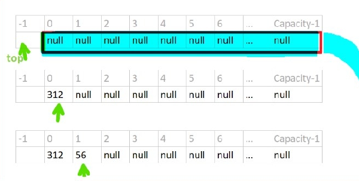
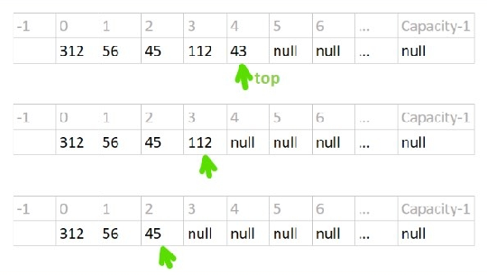
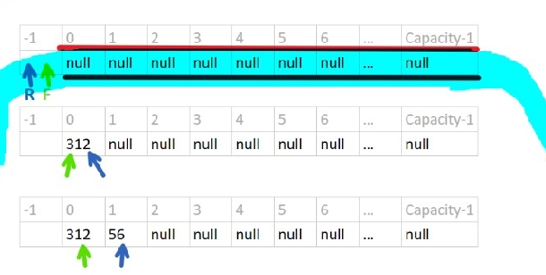
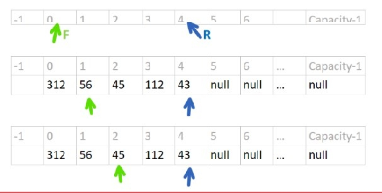
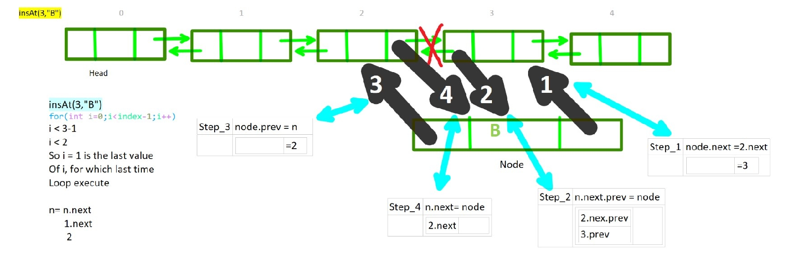
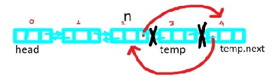

# efficent-with-go-by-hirupam

### [ READ EVERY COMMENTS, THEN YOU WILL SURELY UNDERSTAND THE CONCEPTS ]
### [ I TRY TO MAKE IT WITH A SINGLE APPROACH, IS: AS FAST AS POSSIBLE TO LEARN GOLANG AND BACKEND DEVELOPMENT FROM A SINGLE RESOURCE ]

## Why-go-lang

Backend development languages handle the ‘behind-the-scenes’ functionality of an applications. It’s code that connects the application to a database, manages user connections, and powers the application itself. Backend developers typically earn higher salaries than front-end developers, as backend languages tend to be more technical.

Python: the most-loved programming language and The First suggestion for backend development in 2021.
Python is capable of unleashing its full potential when used in web development, machine learning, and fintech. Moreover, thanks to its scalability, it also proves to be popular among startups. You can check a whole range of Python’s applications in our extensive guide on what's it used for. So as you can see, regardless of whether you’re looking to build a large or small digital product, chances are, you’ll find a relevant Python framework and a knowledgeable team pretty fast.

The second suggestion for backend development in 2021 is a statically typed, compiling programming language: Go, also known as `Golang`. Released in 2009, it has been named the Programming Language of the Year by TIOBE twice so far and – while it’s surely less popular than the above-mentioned Python – it’s been mentioned as the fifth most loved technology by 62.3% of the Stack Overflow survey’s respondents in 2020. If you want to develop faster, perhaps because you have many different services to write, or you have a large team of developers, then Go is your language of choice.
Golang performs on average 40 times better than Python when making the same calculations. 
Python’s response time is longer. In the same timeframe (1 minute), we're able to handle even 10500 requests in Go, whereas in Python we arrive at as much as  2000 requests fewer. 

Rust and Go are both awesome
Go is fast, but Rust is faster.
Go has an efficient garbage collector, but Rust has static memory management.
Go has great concurrency support, but Rust has provably-correct concurrency.
Go has interfaces, but Rust has traits and other zero-cost abstractions.
You can also use Rust to develop a web API, but it wasn’t designed with this use case in mind. Rust’s focus on memory-safety increases complexity and development time, especially for a fairly simple web API. Programming languages that support concurrency better help you to build parallel systems. Concurrency reduces the idle time of a computer system, therefore, languages that support concurrency are popular. Go supports concurrency better than Rust. Your chances of successfully building parallel systems improve if you use Go. Go is easy to understand and use. Rust has more powerful features, which also increases its complexity. Go is an easy-to-use language, therefore, you can develop apps faster with it. On the other hand, the complexities of Rust can slow down the development. Rust has more powerful features than Go. You can achieve more with Rust while coding less.

The Third suggestion for backend development in 2021 is Kotlin

The Fourth suggestion for backend development in 2021 is NodeJS

Justin O'Brien from Competitive team on Valorent! said that the entire backend microservice architecture is built using Golang. This means that everything from spinning up and managing a game server process to purchasing items is all done using services written in golang.

## Variable-and-loop

Variables are just pointing to a memory location. `var i int` here `i` is a variable(name of the variable) which pointing a memory location. `int` is a data type which is used for telling the compiler how much memory is required to store data pointing by `i` variable.
Inside a function, the := short assignment statement can be used in place of a var declaration with implicit type. `i:=10` here `i` is the name of the variable and data is `10` compiler automatically figureout data type or in other words size of the data `10`.
size of the data type int: 
```go

int8 	8 bits      
int16 	16 bits 	
int32 	32 bits 	
int64 	64 bits 	
int 	Platform dependent
```
Every Go program must be a part of some package. A package is nothing but a directory with some code files. The package declaration must be the first line of code in your Go source file.
The purpose of a package is to design and maintain a large number of programs by grouping related features together into single units so that they can be easy to maintain and understand and independent of the other package programs. This modularity allows them to share and reuse. Go programs start running in the main package. It is a special package that is used with programs that are meant to be executable. The main() function is a special function that is the entry point of an executable program.

 `import "fmt" ` fmt is a core library package that contains functionalities related to formatting and printing output or reading input from various I/O sources. It exports functions like Println(), Printf(), Scanf() etc, for other packages to reuse.

In GoLang a variable can be accessible from 3 scope packageLevelScope - accessiblee from only the specific package it defined, GlobalLevelScope - accessiblee from any packages, blockLevelScope - accessiblee from only the specific block-{ } it defined.

```go
var i int // // SYNTAX IS CORRECT
//Here i is the name of the variable. Type of the variable is int. 

package main
import "fmt" 

var packageLevelScope int =12 // this variable accessible from the main package
var GlobalLevelScope int =13 // this variable accessible from any packages
func main() {
	var blockLevelScope int=15 // this variable only accessible from main function
	k := 3 
	m, n, p, q := 1, 34.67, true, "i am string"
	// Outside a function, every statement begins with a keyword (var, func, and so on)
	// and so the := shorthand construct is not available.
	a:=10 // binary 1010
	b:=3  // binary 0011
	a&b   // 0010 -> 2 [1-1=1, 1-0=0, 0-0=0, 0-1=0]
	a|b   // 1011 -> 11 [1-1=1, 1-0=1, 0-0=0, 0-1=1]
	a^b   // 1001 -> 9 [1-1=0, 1-0=1, 0-0=0, 0-1=1]
	a&^b  // 0100 -> 8 [1-1=0, 1-0=0, 0-0=1, 0-1=0]


// FOR loop TYPE 1

	// Here for loop has 3 statements, First is initializer where k is 
	//initialized with 0 by shorthand construct :=,
	// Second is condition(comaprison) where k<10 is tell the compiler that 
	//executes the body of the loop until k<10 is became false.
	// When k becames 10 loop will terminate.
    // Third is increment/decrement which is responsible for make the condition part false at a time. 

	for k:=0;k<10;k++{
		if k%2==0{
			continue // Continue statement at first break the execution of the block,
			// then again start the block for execution.
            //skips the rest of the loop body and starts the next iteration.
		}
		fmt.Print(k) 
    }// 13579
    


	for row:=1; row<=3;row++{
		for col:=1;col<=3;col++{
			fmt.Print(row,":",col," -> ")
			if row*col>=3{
                break  // break statement break the block for execution
                //stops further execution of a loop construct.
			}
		}
	} // 1:1 -> 1:2 -> 1:3 -> 2:1 -> 2:2 -> 3:1 -> 

// Label is just refer a point, we want to point by the execution pointer,
// from where we want to start the execution.

// goto statement is used to alter the normal execution flow and
// transfer control to a labeld statement in the same program.
// when goto statement is encountered, 
// compiler transfer the control to a label: and start execution from there.
// But I personally dont prefer to use goto in programming.

MyLabel: 
	for row:=1; row<=3;row++{
		for col:=1;col<=3;col++{
			fmt.Print(row,":",col," -> ")
			if row*col>=3{
				break MyLabel
			}
		}
	} // 1:1 -> 1:2 -> 1:3 ->


// FOR loop TYPE 2

	// index variable contains index and value variable contains
	// each charachter at a time of a string.
//  here characters are transformed to is ascii value so we need type casting.

    s:="Rupam Ganguly"
	for index,value:=range s{
		fmt.Print(index," :- ", value," -> ")
	}// 0 :- 82 -> 1 :- 117 -> 2 :- 112 -> 3 :- 97 -> 4 :- 109 -> 5 :-  32 -> 6 :- 71
	// -> 7 :- 97 -> 8 :- 110 -> 9 :- 103 -> 10 :- 117 -> 11 :- 108 -> 12 :- 121 ->


	s:="Rupam Ganguly"
	for index,value:=range s{
		fmt.Print(index," :- ", string(value)," -> ") // Convert or typecast from int to string
	} // 0 :- R -> 1 :- u -> 2 :- p -> 3 :- a -> 4 :- m -> 5 :-   -> 6 :- G 
	//-> 7 :- a -> 8 :- n -> 9 :- g -> 10 :- u -> 11 :- l -> 12 :- y -> 
    
// FOR loop TYPE 3
	// here initialization step is performed at package level ,
	// only condition step is present in for loop,
    // increment step performs from body of the for loop.

	i:=1
	for ;i<10; {
		fmt.Print(i)
		i++
	}  // 123456789
	fmt.Println("")
	fmt.Println(i)// 10


// FOR loop TYPE 4
// WHILE loop of Golang
	j:=1
	for j<6{
	fmt.Print(j)
	i++
	}// 12345

 }

```
## Function-and-Panic

Syntax of Function in golang:

```go
func function_name (argument1 type, argument2 type) (return_type1, return_type2){
	return argument1,argument2
}
```
A method is nothing but a function, but it belongs to a certain type. A method is defined with slightly different syntax than a normal function. It required an additional parameter known as a receiver which is a type to which the function belongs. This way, a method (function) can access the properties of the receiver it belongs to (like fields of a struct).

When a method belongs to a type, its receiver receives a copy of the object on which it was called. 

```go
func (recieveCopy type)function_name (argument1 type, argument2 type) (return_type1, return_type2){
	return argument1,argument2
}
```
A method can also belong to the pointer of a type. When a method belongs to the pointer of a type, its receiver will receive the pointer to the object instead of a copy of the object.
If a method has a pointer receiver, then you don’t necessarily need to use the pointer dereferencing syntax (*e) to get the value of the receiver. 

```go
func (recieveReference *type)function_name (argument1 type, argument2 type) (return_type1, return_type2){
	return argument1,argument2
}
```
Panic is a built-in function that stops the ordinary flow of control and begins panicking.
The argument passed to the panic function will be printed when the program terminates.
 When the function lets Fu function calls panic, execution of Fu stops, any deferred functions in Fu are executed normally, and then Fu returns to its caller. 

Recover is a built-in function that regains control of a panicking goroutine. Recover is only useful inside deferred functions. During normal execution, a call to recover will return nil and have no other effect. If the current goroutine is panicking, a call to recover will capture the value given to panic and resume normal execution.


```go
package main

import "fmt"

func factorial(num int) int {
	if num > 1 {
		return num * factorial(num-1)
	}
	return 1
}
func anotherFunc() {
	fmt.Println("I am Another Function")
}

// Function as value - Anonymous function
// its nothing but just the name of the function is not present, and 
// then we srore the return of the function, to a variable result.
// we can call it via `result(6, 9)`

var result = func(a, b int) int {
	return a + b
}

// Aother example: 

// subtra := func(a, b int) int {
	// 	return a - b
	// }(89, 20)

// now we can use only the variable name(subtra), as arguments(89,20)
// are passed at the time of definition 


func main() {
	fmt.Println("Factorial of 4", factorial(4)) //Factorial of 4 24
	defer anotherFunc()                         //defer keword in GO makes a function 
	//execute at the end of the execution (or when hits return statement) of parent 
	// function from where it is called.
	
	fmt.Println("HI I am MAIN and I execute first instead of defer function")
	fmt.Println("HI I am MAIN and I execute first instead of defer function")
	fmt.Println("HI I am MAIN and I execute first instead of defer function")
	fmt.Println("Calling Function as value - Anonymous function", result(6, 9))
	subtra := func(a, b int) int {
		return a - b
	}(89, 20)
    fmt.Println("Subtra is caling: ", subtra)
    
	defer fmt.Print("First	")
	defer fmt.Print("Second	")
	defer fmt.Print("Third	")


	fmt.Println("---Start")
	defer fmt.Println("---This is defered")

	fmt.Println("---End")

    panicker() // execution does not stops from here as recover() is present
    
    fmt.Println("+++DONE the Main")
    
	panic("BAD THING HAPPENED") // execution stops from here
	fmt.Println("I am ignored by the panic as recover() is not present for the last panic")
}


func panicker() {
	fmt.Println("About to Panic")
	defer func() {

		// synatax of another kind of if block used here:
		//  if intialization; condition{ body }
		if err := recover(); err != nil {
			fmt.Println("ERROR: ", err) // ERROR:  Yoo BAD THING HAPPEN AGAIN
		}
	}() // here `()` indicates we call the anonymous function after define it.
	panic("Yoo BAD THING HAPPEN AGAIN") // execution stops from here
	fmt.Println("DONE PANICKING") // this line never get executed
}
```
#### OUTPUT
```shell
Factorial of 4 24
HI I am MAIN and I execute first instead of defer function
HI I am MAIN and I execute first instead of defer function
HI I am MAIN and I execute first instead of defer function
Calling Function as value - Anonymous function 15
Subtra is caling:  69
---Start
---End
About to Panic
ERROR:  Yoo BAD THING HAPPEN AGAIN
+++DONE the Main
---This is defered
Third	Second	First	I am Another Function
panic: BAD THING HAPPENED

goroutine 1 [running]:
main.main()
	/tmp/sandbox739186246/prog.go:48 +0x607

```
## Struct

A structure has different fields of the same or different data types.  Like a class, we can create an object from this Struct 
```go
type StructName struct {
    field1 fieldType1
    field2 fieldType2
}
```

In the above syntax, StructName is a struct type while field1 and field2 are fields of data type fieldType1 and fieldType2 respectively. 

Struct gives one more ability to add meta-data to its fields. Usually, it is used to provide transformation information on how a struct field is encoded to or decoded from another format (or stored/retrieved from a database), but you can use it to store whatever meta-info you want to, either intended for another package or for your own use.
```go
	type Employee struct {
	firstName string `json:"firstName"`
	lastName  string `json:"lastName"`
	salary    int    `json: "salary"`
	fullTime  int    `json: "fullTime"`
	```

```go
package main

import (
	"fmt"
)

// Anonymous fields
// You can define a struct type without declaring any field names. You have to just 
//define the field data types and Go will use the data type declarations (keywords) as
// the field names.

type DataStruct struct {
	string
	bool
}
type Employee struct {
	firstname string
	lastname  string
	salary    int
	fulltime  bool
}
type myStruct struct{
	foo int
}

func main() {
	// Now that we have a struct type Employee, let’s create a struct ross from it. 
	var ross Employee
	fmt.Println(ross) // {"" 0 false}
	// The zero value of a struct is a struct with all fields set to their own zero values.
	// Hence string will have zero value of ""(can’t be printed), 
	// int will have zero value of 0 and bool will have zero value of false.

	// Initialized fields of a struct
	ross.firstname = "Rupam"
	ross.lastname = "Ganguly"
	ross.salary = 45000
	ross.fulltime = true
	fmt.Println(ross) // {Rupam Ganguly 45000 true}

	// Another way to initialized fields of a struct
	bos := Employee{
		firstname: "Rintu",
		lastname:  "Ganguly",
		salary:    58000,
		fulltime:  true,
		// The comma (,) is absolutely necessary after the value assignment of the last 
		// field while creating a struct using the above syntax.
		// This way, Go won’t add a semicolon just after the last field while compiling the code.
	}
	fmt.Println(bos) // {Rintu Ganguly 58000 true}

	// Another way to initialized fields of a struct
	mos := Employee{"my mosh", "ganguly", 90000, true}
	fmt.Println(mos) // {my mosh ganguly 90000 true}

	// Anonymous struct
	// In case of an anonymous struct, we do not define any derived struct type and we 
	//create a struct by defining the inline struct type and
	//  initial values of the struct fields in the same syntax.
	monica := struct {
		age     int
		salary  int
		teacher bool
	}{
		age: 12, salary: 12345, teacher: true,
	}
	// In the above program, we are creating a struct monica without defining
	// a derived struct type. This is useful when you don’t want to re-use a struct type.
	fmt.Println(monica) // {12 12345 true}


	// DataStruct
	samp1 := DataStruct{"Monday time", true}
	fmt.Println(samp1) // {Monday time true}
	samp1.bool = false
	fmt.Println(samp1) // {Monday time false}
	samp2 := DataStruct{"Sunday", false}
	fmt.Println(samp2) // {Sunday false}
	samp3 := samp1
	fmt.Println(samp3) // {Monday time false}

	// Nested Struct
	// A struct field can be of any data type. Hence, it is perfectly legal to have a 
	// struct field that holds another struct.
	// Hence, a struct field can have a data type that is a struct type. When a struct 
	//field has a struct value, that struct value is called a nested struct 
	//  since it is nested inside a parent struct.

	type UpdatedEmployee struct {
		firstname string
		lastname  string
		salary    int
		fulltime  bool
		data      DataStruct
	}
	nestedstructMy := UpdatedEmployee{
		firstname: "Rintu",
		lastname:  "Ganguly",
		salary:    58000,
		fulltime:  true,
		data:      DataStruct{"new data inserted", true},
	}
	fmt.Println(nestedstructMy)             // {Rintu Ganguly 58000 true {new data inserted true}}
	fmt.Println(nestedstructMy.salary)      // 58000
	fmt.Println(nestedstructMy.data.string) // new data inserted

	var ms *myStruct
	ms=new(myStruct) // alternate syntax: ms=&myStruct{foo:42}
	(*ms).foo=42 // alternate syntax: ms.foo=42 // derefercencing
	fmt.Println((*ms).foo) // alternate syntax: fmt.Println((*ms).foo)

	// To export the field names of a struct, we’ve to follow the same uppercase letter approach.
	// Two structs are comparable if they belong to the same type and have the same field values.

}
```
#### OUTPUT
```shell
{  0 false}
{Rupam Ganguly 45000 true}
{Rintu Ganguly 58000 true}
{my mosh ganguly 90000 true}
{12 12345 true}
&{Rintu Ganguly 58000 true}
{Rintu Ganguly 58000 true}
first name :  Rintu
Rintu
{Monday time true}
{Monday time false}
{Sunday false}
{Monday time false}
{Rintu Ganguly 58000 true {new data inserted true}}
58000
new data inserted
42
```

## Pointer

```go
package main

import (
	"fmt"
)

func passedasReferencee(a *int) { // d is passed
	fmt.Println("*a is : ", *a)
	fmt.Println("a is : ", a)
	fmt.Println("address of a variable is: ", &a)
	fmt.Println("Incrementing:")
	*a++ // incrementing value - *a was 7 , now *a will be 8
	fmt.Println("*a is : ", *a)
	fmt.Println("a is : ", a)

}

func passedasvariable(a int) { // a is copy of c
	fmt.Println("a is : ", a)
	fmt.Println("address of a variable is: ", &a)
	fmt.Println("Incrementing:")
	a++ //a is incremented from 7 to 8
	fmt.Println("a is : ", a)
}


func main() {
	c := 7
	fmt.Println("in main function address of c is : ", &c)
	d := &c // d is memory address of c
	fmt.Println("in main function d is : ", d)
	fmt.Println("in main function *d is : ", *d)
	fmt.Println("passedasReferencee called:--->")
	passedasReferencee(d)
	fmt.Println("after executing function :- ")
	fmt.Println("c is : ", c)
	fmt.Println("d is : ", d)
	fmt.Println("*d is ", *d)
	fmt.Println("passedasVariable called:--->")
	passedasvariable(c) // here we passed c
	fmt.Println("after executing function :- ")
	fmt.Println("c is : ", c) // no change
	fmt.Println("d is : ", d)
}

```
#### 		OUTPUT:
```shell
	in main function address of c is :  0xc000012090
	in main function d is :  0xc000012090
	in main function *d is :  7
	passedasReferencee called:--->       
	*a is :  7
	a is :  0xc000012090
	address of a variable is:  0xc000006030
	Incrementing:
	*a is :  8
	a is :  0xc000012090
	after executing function :-
	c is :  8
	d is :  0xc000012090
	*d is  8
	passedasVariable called:--->
	a is :  8
	address of a variable is:  0xc000012098
	Incrementing:
	a is :  9
	after executing function :-
	c is :  8
	d is :  0xc000012090
```
## Why-use-Pointer-in-code
```go
package main

import "fmt"

var packageLevelScopeVariable int = 12

type Stack []string // the name of the array is Stack, type is string
func noReciver() {
	packageLevelScopeVariable++
	fmt.Println("noReciever->", packageLevelScopeVariable)
}
func (Stack) withReciver() {
	packageLevelScopeVariable++
	fmt.Println("withReciver->", packageLevelScopeVariable)
	//Stack = append(Stack, "one") // : type stack is not an expression
	//fmt.Println(Stack) // : type stack is not an expression

}
func (s Stack) withReciverObject_1() {
	packageLevelScopeVariable++
	fmt.Println("withReciverObject_1->", packageLevelScopeVariable)
	s = append(s, "two")
	fmt.Println(s)
	s = append(s, "three")
	fmt.Println(s)
}
func (s Stack) withReciverObject_2() {
	packageLevelScopeVariable++
	fmt.Println("withReciverObject_2->", packageLevelScopeVariable)
	s = append(s, "four")
	fmt.Println(s)
	s = append(s, "five")
	fmt.Println(s)
}
func (s *Stack) withReciverPOINTERObject_1() {
	packageLevelScopeVariable++
	fmt.Println("withReciverPOINTERObject_1->", packageLevelScopeVariable)
	*s = append(*s, "six")
	fmt.Println(s)
	*s = append(*s, "seven")
	fmt.Println(*s)
}
func (s *Stack) withReciverPOINTERObject_2() {
	packageLevelScopeVariable++
	fmt.Println("withReciverPOINTERObject_2->", packageLevelScopeVariable)
	*s = append(*s, "eight")
	fmt.Println(s)
	*s = append(*s, "nine")
	fmt.Println(*s)
}
func main() {
	noReciver()
// noReciever-> 13
	var st Stack
	st.withReciver()
// withReciver-> 14
	st.withReciverObject_1()
// withReciverObject_1-> 15
// [two]
// [two three]
	st.withReciverObject_2()
// withReciverObject_2-> 16
// [four]
// [four five]
	st.withReciverPOINTERObject_1()
// withReciverPOINTERObject_1-> 17
// &[six]
// [six seven]
	st.withReciverPOINTERObject_2()
// withReciverPOINTERObject_2-> 18
// &[six seven eight]
// [six seven eight nine]
}


```
#### OUTPUT
```shell
noReciever-> 13
withReciver-> 14
withReciverObject_1-> 15
[two]
[two three]
withReciverObject_2-> 16
[four]
[four five]
withReciverPOINTERObject_1-> 17
&[six]
[six seven]
withReciverPOINTERObject_2-> 18
&[six seven eight]
[six seven eight nine]
```
## Interface

An interface is a collection of method signatures that a Type can implement (using methods). Hence interface defines (not declares) the behavior of the object (of the type Type). The primary job of an interface is to provide only method signatures consisting of the method name, input arguments and return types. 

When an interface has zero methods, it is called an empty interface. This is represented by interface{}
```go
package main

import (
	"fmt"
	"math"
)

// in order to successfully implemented an interface,
// we need to implement all the methods declared by the interface with exact signature
type Shape interface {
	// just a struct or class with only some function declaration....
	Area() float64
	Perimeter() float64
}
type AnotherShape interface {
	// just a struct or class with only some function declaration....
	NewArea() string
	NewPerimeter() float64
}
type Rect struct {
	// this is a stuct with only some undefined variables
	width, height float64
}
type Circle struct {
	// this is a stuct with only some undefined variables
	radius float64
}


// here(r Rect) says r is object of Rect class.. 
// actually here, this is the synatax of defining a function outside of a struct
// here we define Area function and Perimeter function of Shape Interfae
//   inside Rect struct.. so that Rect class can implements Shape interface...
// I know syntax is funny.. but its very powerful.. in this one line, compiler do lots of work
func (r Rect) Area() float64 {
	fmt.Println(r.width * r.height)
	return 7
}
func (r Rect) Perimeter() float64 {
	fmt.Println(2 * (r.width + r.height))
	return 7
}
// Now Circle class also try to implements Shape interface 
func (c Circle) Perimeter() float64 {
	fmt.Println(2 * (math.Pi * c.radius))
	return 7
}
func (c Circle) Area() float64 {
	fmt.Println(math.Pi * c.radius * 2)
	return 7
}

// Here Rect class again implements AnotherShape interface.. so Rect class implements 2 interfaces..
func (r Rect) NewArea() string {
	return "Implements multiple interfaces"
}
func (r Rect) NewPerimeter() float64 {
	return 9874321
}
func main() {
	var s Shape = Rect{10, 3}
	s.Area() // 30
	// multiple interface of Rect
	var ns AnotherShape = Rect{5, 8}
	fmt.Println(ns.NewArea())      // Implements multiple interfaces
	fmt.Println(ns.NewPerimeter()) // 9.874321e+06
	s = Circle{10}
	s.Perimeter() // 62.83185307179586

	//when Area() didnt implemented by c Circle then we get error:
	//cannot use Circle literal (type Circle) as type Shape in assignment:
	//Circle does not implement Shape (missing Area method)

}
```
#### OUTPUT
```shell
30
Implements multiple interfaces
9.874321e+06
62.83185307179586

```
Two interfaces can be compared with == and != operators. Two interfaces are always equal if the underlying dynamic values are nil, which means, two nil interfaces are always equal, hence == operation returns true.

We can find out the underlying dynamic value of an interface using the syntax i.(Type) where i is a variable of type interface and Type is a type that implements the interface. Go will check if dynamic type of i is identical to the Type and return the dynamic value is possible.

```go
package main

import "fmt"

func explain(i interface{}) {
	switch i.(type) { 
	// we pass type of i in switch, accroding to the type cases are happen
	case string:
		fmt.Println(" Interface has a String")
	case int:
		fmt.Println("Interface has a Int")
	default:
		fmt.Println("Interface has other Type")
	}
}  
func main() {
	explain("Rupam Ganguly")
	explain(45.987)
	explain(43)
}
```
#### OUTPUT
```shell
Interface has a String
Interface has other Type
Interface has a Int
```
## Mimic-of-Inheritance

A key feature supporting traditional object oriented design is inheritance. Inheritance supports sharing of code and data, between related objects.  Inheritance means inheriting the properties of the superclass into the base class and is one of the most important concepts in Object-Oriented Programming. Since Golang does not support classes, so inheritance takes place through struct embedding. We cannot directly extend structs but rather use a concept called composition where the struct is used to form other objects. So, you can say there is No Inheritance Concept in Golang.
composition relationship ["has a" relationship]
In composition, base structs can be embedded into a child struct and the methods of the base/parent struct can be directly called on the child struct 
Multiple inheritances take place when the child struct is able to access multiple properties, fields, and methods of more than one base struct. 

```go
// In GO we can use struct for inheritance, we can compose using structs to form other objects
package main

import "fmt"

type ParentClass struct {
	color      string
	background string
}

// thats how we define function of ParentClass struct -outsude of the class/struct....
func (ParentClass) basFuncOne() string {
	return "I am Base Function ONE"
}
func (ParentClass) basFuncTwo() string {
	return "I am Base Function TWO"
}

type ChildClass struct {
	ParentClass
	style    string
	fontsize int
}


// thats how we define function of ChildClass outside class/struct
func (c ChildClass) childFunc() string {
	return "I am Child Function "
}
func main() {
	// Patent object creation
	baseObj := ParentClass{
		color:      "Black",
		background: "White",
	}
	// Child object creation
	childObj := ChildClass{
		ParentClass: baseObj,
		style:       "bold",
		fontsize:    32,
	}
	fmt.Println(childObj)    // {{Black White} bold 32}
	childObj.color = "Green" // childObj can access color backgroud fields of Base STRUCT
	childObj.background = "Red"
	childObj.fontsize = 16
	fmt.Println(childObj)              // {{Green Red} bold 16}
	fmt.Println(childObj.basFuncOne()) // childObj can access basFunc Function of Base STRUCT
	fmt.Println(childObj.basFuncTwo()) // I am Base Function ONE // I am Base Function TWO
	fmt.Println(childObj.childFunc())
}
```
#### OUTPUT
```shell
{{Black White} bold 32}
{{Green Red} bold 16}
I am Base Function ONE
I am Base Function TWO
I am Child Function 
```
### ComandLine-Argument-Passing

we can run go file with passing arguments to it, like: `go run demo.go 1234` here 1234 is the agument of int type.

```go
package main

import (
	"fmt"
	"os"
)

func main() {
	if len(os.Args) != 2 {
		// If you’re wondering why we expect 2 arguments,
		// it’s because the first argument – at index 0 – is always
		// the path of the currently running executable.
		os.Exit(1)
	}
	fmt.Println("It's over", os.Args[1])
}
```
#### OUTPUT
```shell
PS E:\PROJECTS\BACKEND\gobackendcrud> go run demo.go
exit status 1
PS E:\PROJECTS\BACKEND\gobackendcrud> go run demo.go 1234
It's over 1234
PS E:\PROJECTS\BACKEND\gobackendcrud> 
```
## Allocation

Go has two allocation primitives, the built-in functions new and make. new is a built-in function that allocates memory, but unlike its namesakes in some other languages it does not initialize the memory, it only zeros it. 
That is, `new(T)` allocates zeroed storage for a new item of type T and returns its address, a value of type `*T`. 

```go
package main

import "fmt"

type myBox struct {
	index int
	data  int
}

func main() {
	obj1 := new(myBox)
	fmt.Println(obj1)  // &{0 0}
	fmt.Println(*obj1) // {0 0}
	var obj2 myBox
	fmt.Println(obj2) // {0 0}
	//fmt.Println(*obj2) // invalid indirect of obj2 (type myBox)
}
```
#### OUTPUT
```shell
&{0 0}
{0 0}
{0 0}
```
The built-in function `make(T, args)` serves a purpose different from new(T). It creates slices, maps, and channels only, and it returns an initialized (not zeroed) value of type T (not *T). The reason for the distinction is that these three types represent, under the covers, references to data structures that must be initialized before use. Example of make function is present in Slice section...

## Array
Basically, an array is a number of elements of same type stored in sequential order.
Once you declare an array with its size you are not allowed to change it.
If you try to insert more elements than array size, compiler will give you an error.
By default array size is 0 (zero)
Array index starts from 0th index
We can set value directly to array at particular index `array_name[index]=value`
The inbuilt len returns length of an array
```go
package main

import "fmt"

func main() {
	grades:=[...]int64{12,32,11,45}
	gradesssss:=[11]int64{12,32,11,45}
	fmt.Println(grades) // [12 32 11 45]
	fmt.Println(len(grades)) // 4
	fmt.Println(len(gradesssss)) // 1
	x := [12]int{1, 2, 3, 4, 5, 6, 7, 8, 9}
	fmt.Println(x) // [1 2 3 4 5 6 7 8 9 0 0 0]
	var y [12]int
	fmt.Println(y) // [0 0 0 0 0 0 0 0 0 0 0 0]
	y[5] = 45
	y[2] = 12
	fmt.Println(y) // [0 0 12 0 0 45 0 0 0 0 0 0]
	y[5] = 123
	fmt.Println(y) // [0 0 12 0 0 123 0 0 0 0 0 0]
	fmt.Println("length of y: ", len(y)) // length of y:  12
	for i := 0; i < len(y); i++ {
		fmt.Print(y[i], " - ") // 0 - 0 - 12 - 0 - 0 - 123 - 0 - 0 - 0 - 0 - 0 - 0 -
	}
	fmt.Println()
	for i := 0; i < len(y); i++ {
		fmt.Print(y[i]+x[i], " - ") // 1 - 2 - 15 - 4 - 5 - 129 - 7 - 8 - 9 - 0 - 0 - 0 -
	}

	var matrix [3][4]int
	matrix[0]=[4]int{1,2,3,4}
	matrix[1]=[4]int{5,6,7,8}
	matrix[2]=[4]int{9,10,11,12}
	fmt.Println(matrix)
}
```
#### OUTPUT
```shell
[12 32 11 45]
4
11
[1 2 3 4 5 6 7 8 9 0 0 0]
[0 0 0 0 0 0 0 0 0 0 0 0]
[0 0 12 0 0 45 0 0 0 0 0 0]
[0 0 12 0 0 123 0 0 0 0 0 0]
length of y:  12
0 - 0 - 12 - 0 - 0 - 123 - 0 - 0 - 0 - 0 - 0 - 0 -
1 - 2 - 15 - 4 - 5 - 129 - 7 - 8 - 9 - 0 - 0 - 0 - 

[[1 2 3 4] [5 6 7 8] [9 10 11 12]]

```
### SLICE

Slice is the same as an array but it has a variable length so we don’t need to specify the length to it. It will grow whenever it exceeds its size. Like an array, slice also has index and length but its length can be changed.
Slice also has continuous segments of memory locations
The default value of uninitialized slice is nil
Slices does not store the data. It just provides reference to an array
As we change the elements of slice, it will modify corresponding elements of that array
What go does is just create an array of size- Double the previous size of the array when the array is full
thats how slice achive it's dynamic nature.
So its efficent to tell the capacity if possible to the slice, when it is initialized, if the array is big enough
to full your RAM. 
`z := make([]int, 12,100)` here 12 is length and 100 is the capacity.

```go
package main

import "fmt"

func main() {
	var x []int
	fmt.Println(x) // []
	y := []int{2, 3, 4, 5, 6, 7}
	fmt.Println(y) // [2 3 4 5 6 7]
	z := make([]int, 12)
	fmt.Println(z)      // [0 0 0 0 0 0 0 0 0 0 0 0]
	fmt.Println(y[3:5]) // [5 6]
	fmt.Println(y[1:5]) // [3 4 5 6]
	fmt.Println(y[:4])  // [2 3 4 5]
	sl := make([][]int, 12)
	fmt.Println(sl) // [[] [] [] [] [] [] [] [] [] [] [] []]
	for i := range sl {
		fmt.Print(sl[i], " -> ") 
		// [] -> [] -> [] -> [] -> [] -> [] -> [] -> [] -> [] -> [] -> [] -> [] ->
	}
	fmt.Println()
	slicef := [5][3]int{}
	fmt.Println(slicef) // [[0 0 0] [0 0 0] [0 0 0] [0 0 0] [0 0 0]]
	//slicef[1][1] = j
	for i := range slicef {
		fmt.Print(" row ", i, " -> ")
		for j := 0; j < len(slicef[0]); j++ {
			fmt.Print(" col ", j)
		}
		fmt.Println()

	}
	// row 0 ->  col 0 col 1 col 2
	// row 1 ->  col 0 col 1 col 2
	// row 2 ->  col 0 col 1 col 2
	// row 3 ->  col 0 col 1 col 2
	// row 4 ->  col 0 col 1 col 2
	k := 0
	for i := range slicef {
		for j := 0; j < len(slicef[0]); j++ {
			slicef[i][j] = k
			k++
		}
	}
	fmt.Println(slicef) // [[0 1 2] [3 4 5] [6 7 8] [9 10 11] [12 13 14]]
	fmt.Println(x)      // []
	x = append(x, 34)
	fmt.Println(x) // [34]
	x = append(x, 12, 7, 9, 1)
	fmt.Println(x) // [34 12 7 9 1]
	for i, v := range x {
		fmt.Printf("INDEX: %d Value: %d \n ", i, v)
	}
		//  INDEX: 0 Value: 34
		//  INDEX: 1 Value: 12
		//  INDEX: 2 Value: 7
		//  INDEX: 3 Value: 9 
		//  INDEX: 4 Value: 1
}
```
#### OUTPUT
```shell
[]
[2 3 4 5 6 7]
[0 0 0 0 0 0 0 0 0 0 0 0]
PS E:\PROJECTS\BACKEND\gobackendcrud> go run datastructure.go
[]
[2 3 4 5 6 7]
[0 0 0 0 0 0 0 0 0 0 0 0]
[5 6]
[3 4 5 6]
[2 3 4 5]
[[] [] [] [] [] [] [] [] [] [] [] []]
[] -> [] -> [] -> [] -> [] -> [] -> [] -> [] -> [] -> [] -> [] -> [] -> 
[[0 0 0] [0 0 0] [0 0 0] [0 0 0] [0 0 0]]
 row 0 ->  col 0 col 1 col 2
 row 1 ->  col 0 col 1 col 2
 row 2 ->  col 0 col 1 col 2
 row 3 ->  col 0 col 1 col 2
 row 4 ->  col 0 col 1 col 2
[[0 1 2] [3 4 5] [6 7 8] [9 10 11] [12 13 14]]
[]
[34]
[34 12 7 9 1]
INDEX: 0 Value: 34
 INDEX: 1 Value: 12
 INDEX: 2 Value: 7
 INDEX: 3 Value: 9 
 INDEX: 4 Value: 1
```
#### Deleting-Element-From-Slice
```go
package main

import "fmt"

func main() {
	slicel := []string{"A", "B", "C", "D", "E", "F", "G"}
	i := 3
	fmt.Println(slicel) // [A B C D E F G]
	slicel[i] = slicel[len(slicel)-1] // D chanded to G
	slicel[len(slicel)-1] = "" // Last G changed to empty
	slicel = slicel[:len(slicel)-1] // slice is initialized with different size
	fmt.Println(slicel) // [A B C G E F]

	// Maintain Order:
	slicel = []string{"A", "B", "C", "D", "E", "F", "G"}
	fmt.Println(slicel) // [A B C D E F G]
	copy(slicel[i:], slicel[i+1:])
	//copy(to- slice[from 3rd index to last ] from- slice[from 4th index to Last ] )
	fmt.Println(slicel) // [A B C E F G G]
	slicel[len(slicel)-1] = ""
	fmt.Println(slicel) // [A B C E F G ]
	slicel = slicel[:len(slicel)-1]
	fmt.Println(slicel) // [A B C E F G]
}
```
#### OUTPUT
```shell
[A B C D E F G]
[A B C G E F]
[A B C D E F G]
[A B C E F G G]
[A B C E F G ]
[A B C E F G]
```
### MAP

Maps are a convenient and powerful built-in data structure that associate values of one type (the key) with values of another type (the element or value). The key can be of any type for which the equality operator is defined, such as integers, floating point and complex numbers, strings, pointers, interfaces (as long as the dynamic type supports equality), structs and arrays. Slices cannot be used as map keys, because equality is not defined on them. Like slices, maps hold references to an underlying data structure. If you pass a map to a function that changes the contents of the map, the changes will be visible in the caller.

```go
package main

import (
	"fmt"
	"sort"
)

var myMap map[int]string

func main() {
	fmt.Println(myMap) // map[]
	//myMap[12] = "I am value of key 12 "
	//fmt.Println(myMap) // panic: assignment to entry in nil map

	// Map types are reference types, like pointers or slices,
	//  and so the value of myMap above is nil; it doesn't point to an initialized map.
	// A nil map behaves like an empty map when reading,
	// but attempts to write to a nil map will cause a runtime panic; don't do that.
	// To initialize a map, use the built in make function ro := operator :
	myMap = make(map[int]string)
	fmt.Println(myMap) //map[]

	myMapOne := map[int]int{

	}
	fmt.Println(myMapOne) // map[]


	myMap[16] = "I am value of key 16"
	fmt.Println(myMap) // map[16:I am value of key 16]
	myMap[17] = "I am value of key 17"
	fmt.Println(myMap) // map[16:I am value of key 16 17:I am value of key 17]
	myMap[21] = "I am value of key 21"
	fmt.Println(myMap) 
	// map[16:I am value of key 16 17:I am value of key 17 21:I am value of key 21]
	
	val := myMap[17]
	fmt.Println(val) // I am value of key 17

	anotherVal, isPresent := myMap[12345] 
	// another value store the value of the specific key if key is present
	fmt.Println(anotherVal, "->", isPresent) // -> false
	
	
	//The built in delete function removes an entry from the map:
	delete(myMap, 16)
	fmt.Println(myMap)      // map[17:I am value of key 17 21:I am value of key 21]
	fmt.Println(len(myMap)) // 2
	anotherMap := map[string]string{
		"one":   "i am value of 1",
		"two":   "i am value of 2",
		"three": "i am value of 3",
		"four":  "i am value of 4",
		"five":  "i am value of 5",
		"six":   "i am value of 6",
		"seven": "i am value of 7",
	}
	for key, val := range anotherMap {
		fmt.Println("Key is : ", key, " Value is : ", val, " - > ")
	}
	// Key is :  one  Value is :  i am value of 1  - >
	// Key is :  two  Value is :  i am value of 2  - >
	// Key is :  three  Value is :  i am value of 3  - >
	// Key is :  four  Value is :  i am value of 4  - >
	// Key is :  five  Value is :  i am value of 5  - >
	// Key is :  six  Value is :  i am value of 6  - >
	// Key is :  seven  Value is :  i am value of 7  - >

	//see when we run same code twice then the output will be different - not ordered

	// Key is :  six  Value is :  i am value of 6  - >
	// Key is :  seven  Value is :  i am value of 7  - >
	// Key is :  one  Value is :  i am value of 1  - >
	// Key is :  two  Value is :  i am value of 2  - >
	// Key is :  three  Value is :  i am value of 3  - >
	// Key is :  four  Value is :  i am value of 4  - >
	// Key is :  five  Value is :  i am value of 5  - >

	// When iterating over a map with a range loop, the iteration order is not specified
	// and is not guaranteed to be the same from one iteration to the next.
	// If you require a stable iteration order
	// you must maintain a separate data structure that specifies that order.
	myMap[34] = "I am value of key 34"
	myMap[41] = "I am value of key 41"
	myMap[4] = "I am value of key 4"
	
	var sliceOfKeys []int
	for k := range myMap {
		sliceOfKeys = append(sliceOfKeys, k)
	}
	fmt.Println(sliceOfKeys) // [41 4 34 17 21]
	sort.Ints(sliceOfKeys)

	fmt.Println(sliceOfKeys) // [4 17 21 34 41]

	for _, ki := range sliceOfKeys {
		fmt.Println("key: ", ki, " Value: ", myMap[ki])
	}
	// key:  4  Value:  I am value of key 4
	// key:  17  Value:  I am value of key 17
	// key:  21  Value:  I am value of key 21
	// key:  34  Value:  I am value of key 34
	// key:  41  Value:  I am value of key 41

}
```
#### OUTPUT
```shell
map[]
map[]
map[]
map[16:I am value of key 16]
map[16:I am value of key 16 17:I am value of key 17]
map[16:I am value of key 16 17:I am value of key 17 21:I am value of key 21]
I am value of key 17
 -> false
map[17:I am value of key 17 21:I am value of key 21]
2
Key is :  two  Value is :  i am value of 2  - >
Key is :  three  Value is :  i am value of 3  - >
Key is :  four  Value is :  i am value of 4  - >
Key is :  five  Value is :  i am value of 5  - >
Key is :  six  Value is :  i am value of 6  - >
Key is :  seven  Value is :  i am value of 7  - >
Key is :  one  Value is :  i am value of 1  - >
[41 4 34 17 21]
[4 17 21 34 41]
key:  4  Value:  I am value of key 4
key:  17  Value:  I am value of key 17
key:  21  Value:  I am value of key 21
key:  34  Value:  I am value of key 34
key:  41  Value:  I am value of key 41
```

## STACK


 A stack is an ordered data structure that follows the Last-In-First-Out (LIFO) principle.
 Stacks are most easily implemented in Golang using slices:
An element is pushed to the stack with the built-in append function.
The element is popped from the stack by slicing off the top element.

```go


package main

import "fmt"

type Stack []interface{}
//type Stack []string
func (s *Stack) Push(item interface{}) {
// func (s *Stack) Push(item string) {
	*s = append(*s, item)
}

```


```go
func (s *Stack) Pop() bool {
	if len(*s) != 0 {
		index := len(*s) - 1
		*s = (*s)[:index]
		return true
	}
	return false
}

```


## QUEUE

Queue follows a FIFO (First-In-First-Out) structure, the dequeue and enqueue operations can be performed as follows:
Use the built-in append function to enqueue.
Slice off the first element to dequeue.

```go
package main

import "fmt"

type Queue []interface{}

func (q *Queue) push(item interface{}) {
	*q = append(*q, item)
}
func (q *Queue) pop() {
	if len(*q) != 0 {
		*q = (*q)[1:]
	}
}
```





## Doubly-Linked-List
Linked list is a linear collection of data elements whose order is not given by their physical placement in memory. Instead, each element points to the next. It is a data structure consisting of a collection of nodes which together represent a sequence.
In simple words, we can say, linked list is a collection of nodes. Node consists of two parts:
 `Data`
`Pointers-> next previous`

```go

package main

import "fmt"

type Node struct {
	data interface{}
	next *Node
	prev *Node
}
type LinkedList struct {
	head *Node
	size int
}

func (l *LinkedList) show() {
	list := l.head
	for list != nil {
		//fmt.Println(list.data)
		fmt.Printf("%v -> ", list.data)
		list = list.next
	}
	fmt.Println("-------------$$$$$$$$$$$$----------------")
}
```



```go
func (l *LinkedList) insertAt(item interface{}, index int) {
	
	node := &Node{
		data: item,
	}
	if index == 0 {

		if l.head != nil {
			node.next = l.head
			l.head.prev = node
		}
		l.head = node
	} else {
		n := l.head
		for i := 0; i < index-1; i++ {
			n = n.next
		}
		if n.next != nil {
			node.next = n.next
			n.next.prev = node
		}
		node.prev = n
		n.next = node
	}
	l.size++
}
```


```go
func (l *LinkedList) deleteAt(index int) {
	if index < l.size {
		if index == 0 {
			if l.size == 1 {
				l.head = nil
				l.size--
			} else {
				l.head = l.head.next
				l.head.prev = nil
				l.size--
			}
		} else {
			n := l.head
			for i := 0; i < index-1; i++ {
				n = n.next
			}
			temp := n.next
			if temp.next != nil {
				n.next = temp.next
				temp.next.prev = n
				l.size--
			} else {
				n.next = nil
				l.size--
			}
		}
	}
}
```

```shell
12 Insert at 0 
12 -> -------------$$$$$$$$$$$$----------------
13 Insert at 0
13 -> 12 -> -------------$$$$$$$$$$$$----------------
15 Insert at 0
15 -> 13 -> 12 -> -------------$$$$$$$$$$$$----------------
rupam Insert at 0
rupam -> 15 -> 13 -> 12 -> -------------$$$$$$$$$$$$----------------
11 Insert at 0
11 -> rupam -> 15 -> 13 -> 12 -> -------------$$$$$$$$$$$$----------------
17 Insert at 3
11 -> rupam -> 15 -> 17 -> 13 -> 12 -> -------------$$$$$$$$$$$$----------------
100 Insert at 6
11 -> rupam -> 15 -> 17 -> 13 -> 12 -> 100 -> -------------$$$$$$$$$$$$----------------
45 Insert at 1
11 -> 45 -> rupam -> 15 -> 17 -> 13 -> 12 -> 100 -> -------------$$$$$$$$$$$$----------------
delete at 0
45 -> rupam -> 15 -> 17 -> 13 -> 12 -> 100 -> -------------$$$$$$$$$$$$----------------
delete at 6
45 -> rupam -> 15 -> 17 -> 13 -> 12 -> -------------$$$$$$$$$$$$----------------
delete at 3
45 -> rupam -> 15 -> 13 -> 12 -> -------------$$$$$$$$$$$$----------------
delete at 21
45 -> rupam -> 15 -> 13 -> 12 -> -------------$$$$$$$$$$$$----------------
```

## Binary-search-tree

```go
package main

// Node ...
type Node struct {
	key  int
	data string
	l    *Node
	r    *Node
}

// Bst ...
type Bst struct {
	root *Node
}

// derefferncing will done by the compiler automatically
func (n *Node) insertRecursively(node Node) {
	// function to find the correct place for a node in a tree

	// when new node is lesser than n -> go to left subtree of n and
	//again
	//start the function by making - left child of n ->as n
	// restore Point(Previous Execution State) stored at callstack.. it restored again when
	// newly function call finshed..
	// when new node is greater than n -> go to right subtree of n and
	//again
	//start the function by making - right child of n ->as n
	// restore Point(Previous Execution State) stored at callstack.. it restored again when
	// newly function call finshed..
	if n == nil {
		return //  base condition of Recursive Problem->    if(n==null) return ;
	} else if node.key <= n.key {
		if n.l == nil {
			n.l = &node
		} else {
			n.l.insertRecursively(node)
		}
	} else {
		if n.r == nil {
			n.r = &node
		} else {
			n.r.insertRecursively(node)
		}
	}
}

func (bst *Bst) insert(keyy int, value string) *Bst {
	// insert function create Node then add the node to its correct position by calling insertRecursively()

	node := &Node{key: keyy, data: value}
	if bst.root == nil {
		bst.root = &Node{key: keyy, data: value}
	} else {
		bst.root.insertRecursively(*node)
	}
	return bst
}
func searchRecursively(keyy int, n *Node) bool {

	if n == nil {
		return false //// base case of recursive problem.
	}
	// recursively call for left subtree and right subtree, by checking the key is smaller or greater than n
	//(as it is recursive function- here n variable contains actually curent node each time..)
	// when key is lesser than n -> go to left subtree of n and
	//again
	//start the function by making - left child of n ->as n
	// when key is greater than n -> go to right subtree of n and
	// again
	//start the function by making - right child of n ->as n
	if keyy < n.key {
		return searchRecursively(keyy, n.l)
	}
	if keyy > n.key {
		return searchRecursively(keyy, n.r)
	}
	// we find the match so return true
	return true
}

func (bst *Bst) search(keyy int) bool {
	return searchRecursively(keyy, bst.root)
}
func removeRecursively(keyy int, n *Node) *Node {
	if n == nil {
		// base case of recursive Problem.
		return nil
	}
	if keyy < n.key {
		// find the element at left subtree
		n.l = removeRecursively(keyy, n.l)
		return n
	}
	if keyy > n.key {
		// find the element at right subtree
		n.r = removeRecursively(keyy, n.r)
		return n
	}
	//when found then:-
	if keyy == n.key {
		// no child
		if n.l == nil && n.r == nil {
			n = nil
			return nil
		}
		// single child
		if n.l == nil {
			// if it has only right child then replaced it with right child.
			n = n.r
			return n
		}
		if n.r == nil {
			// if it has only left child then replaced it with left child.
			n = n.l
			return n
		}
		// two children

		// try to find the next small node after the node which we want to delete
		// here we create and initialize lmostOfRight variable as -> n.right, means we just have to find
		// the smallest of n.right, because that will be the in-Order Successor
		lmostOfRight := n.r
		for {
			if lmostOfRight != nil && lmostOfRight.l != nil {
				lmostOfRight = lmostOfRight.l // just incrementing towards left...
			} else {
				break
			}
		}
		// Found it,
		//then... replace with it
		//as it has both child then replaced it with in order successor. then delete that inorder successor as
		// it is still prsent at its position.
		//Now the twist is as it is inorder successor so it can have right child or no chils, as it is left most of n.right.
		// Now again we call delete function by passing the inorder successor's key.
		n.key, n.data = lmostOfRight.key, lmostOfRight.data
		//then... delete it
		n.r = removeRecursively(n.key, n.r)
		return n
	}
	return n
}
func (bst *Bst) remove(keyy int) {
	removeRecursively(keyy, bst.root)
}


```


## Backend-Development

In this whole Note I will try to avoid error handeling as it is so easy that you just replace '_' to err
then you have to add this if block :

```go
if err != nil
{
 log.Printf("error is : ", err)
 return
}

```
This will print the error .

### Gorilla-Mux-demo
```go
// Go’s net/http package offers a lot of functionalities for URL routing of the HTTP
// requests. One thing it doesn’t do very well is dynamic URL routing. Fortunately, we
// can achieve this with the gorilla/mux package

package main

import (
	"net/http"

	"github.com/gorilla/mux"
)

// First, we defined GetRequestHandler and PostRequestHandler, which simply write a
// message on an HTTP response stream

//GetRequestHandler ...
var GetRequestHandler = http.HandlerFunc(func(response http.ResponseWriter, request *http.Request) {
	response.Write([]byte("get request handler"))
})

//PostRequestHandler ...
var PostRequestHandler = http.HandlerFunc(func(response http.ResponseWriter, request *http.Request) {
	response.Write([]byte("post request handler"))
})

// we defined PathVariableHandler, which extracts request path variables, gets the
// value, and writes it to an HTTP response stream

//GetRequestPATHVarHandler ...
var GetRequestPATHVarHandler = http.HandlerFunc(func(response http.ResponseWriter, request *http.Request) {
	vars := mux.Vars(request)
	name := vars["name"]
	response.Write([]byte(" Get Request PATH VarHandler -> " + name))
})

func main() {
	// 	Once we run the program, the HTTP server will start locally listening on port 8080, and
	// accessing http://localhost:8080/, http://localhost:8080/poster, and
	// http://localhost:8080/hello/Rupam Ganguly from a browser or command line will produce the
	// message defined in the corresponding handler definition.
	router := mux.NewRouter()
	router.Handle("/", GetRequestHandler).Methods("GET")
	router.Handle("/poster", PostRequestHandler).Methods("POST")
	router.Handle("/hello/{name}", GetRequestPATHVarHandler).Methods("GET")
	http.ListenAndServe("localhost:8080", router)
}
```
### HTML-CSS-TEMPLATE-RENDERING
HTML -

```html
<!DOCTYPE html>
<html lang="en">
<head>
    <meta charset="UTF-8">
    <meta name="viewport" content="width=device-width, initial-scale=1.0">
    <title>Template</title>
    <link href="styles/style.css" type="text/css" rel="stylesheet"/>
</head>
<body>
    <!-- The preceding template has two placeholders, {{.Name}} and {{.Id}},
	
	 whose
values will be substituted or injected by the template engine at runtime. -->

    <h1>Hello {{.Name}} </h1>
    Your ID is {{.Id}}
</body>
</html>
```
CSS -

```css
body{
    color: blue;
}
```

Go -

```go
package main

import (
	"fmt"
	"html/template"
	"net/http"

	"github.com/gorilla/mux"
)

//  Here we define a person struct type that
// has Id and Name fields.

// Person ...
type Person struct {
	Id   string
	Name string
}

// RenderTemplate ...
var RenderTemplate = http.HandlerFunc(func(response http.ResponseWriter, request *http.Request) {
	fmt.Println("hi")
	person := Person{Id: "1134", Name: "Rupam Ganguly"}
	// Here we are calling ParseFiles of the templates/template.html package, which creates a new template and
	// parses the filename we pass as an input, which is template.html ,
	// The resulting template will have the name and contents of the input file.
	
	parsTemp, _ := template.ParseFiles("templates/template.html")
	parsTemp.Execute(response, person)

	// 	 parsedTemplate.Execute(response, person): Here we are calling an Execute handler on a
	// parsed template, which injects person data into the template, generates an HTML
	// output, and writes it onto an HTTP response stream.
})

func main() {
	router := mux.NewRouter()
	router.Handle("/", RenderTemplate).Methods("GET")
	// 	PathPrefix adds a matcher for the URL path prefix. This matches if the given template is a prefix of the full URL path.
	// Note that it does not treat slashes specially ("/foobar/" will be matched by the 
	//  prefix "/foo") so you may want to use a trailing slash here.
	//When you specify a path using PathPrefix() it has an implicit wildcard at the end.
	//On the other hand, when you specify a path using Path(), there's no such implied wildcard suffix.
	router.PathPrefix("/styles/").Handler(http.StripPrefix("/styles/", http.FileServer(http.Dir("templates/styles/"))))// actually this is little complicated...
	http.ListenAndServe("localhost:8080", router)
}

// Assume that
// I have a file

// /home/go/src/js/kor.js
// Then, tell fileserve serves local directory

// fs := http.FileServer(http.Dir("/home/go/src/js"))
// Example 1 - root url to Filerserver root
// Now file server takes "/" request as "/home/go/src/js"+"/"

// http.Handle("/", fs)
// Yes, http://localhost/kor.js request tells Fileserver, find kor.js in

// "/home/go/src/js" +  "/"  + "kor.js".
// we got kor.js file.
```


### Interact-with-Form


form.html

```html
<!DOCTYPE html>
<html lang="en">
<head>
    <meta charset="UTF-8">
    <meta name="viewport" content="width=device-width, initial-scale=1.0">
    <title>Document</title>
    <link href="styles/main.css" type="text/css" rel="stylesheet"/>
</head>
<body>
    <h1>Log In</h1>
    <form method="POST" action="/login">
        <label for="ussername">Name</label>
        <input type="text" id="uname" name="username">
        <label for="password">Password</label>
        <input type="password" id="pword" name="password">
        <label for="email">email</label>
        <input type="email" id="eml" name="email">
        <p>type Comment : </p>
        <textarea name="comment"placeholder="Remember, be nice!" cols="30" rows="5"></textarea>
        <p></p>
        <button type="submit">LOGIN</button>
    </form>
</body>
</html>
```

homepage.html

```html
<!DOCTYPE html>
<html lang="en">
<head>
    <meta charset="UTF-8">
    <meta name="viewport" content="width=device-width, initial-scale=1.0">
    <title>Document</title>
</head>
<body>
    <h1>are Logged In {{.Username}}</h1> 
    <p>
        your comment is {{.Comment}}</p>
</body>
</html>
```
main.css

```css
label{
    color: darkcyan;
}
button{
    background-color: darkgreen;
    color: floralwhite;
    width: 200px;
    height: 3em;
    text-align: center;
    display: inline;
    font-size: medium;
}
textarea {
    width: 400px;
    height: 20em;
	}
```

form.go

```go
package main

import (
	"fmt"
	"html/template"
	"net/http"
	"strings"

	"github.com/gorilla/mux"
)

//User ...
type User struct { // DATA MODEL
	Username string
	password string
	email    string
	Comment  string
}

func formValidatorStringCount(user *User) bool {
	if len(user.Username) < 3 || len(user.password) < 6 {
		return false
	}
	return true
}
func isLetter(c rune) bool {
	return ('a' <= c && c <= 'z') || ('A' <= c && c <= 'Z')
}

func isWord(s string) bool {
	for _, c := range s {
		if !isLetter(c) {
			return false
		}
	}
	return true
}
func isGmail(s string) bool {
	if strings.ContainsAny(s, "@gmail.com") {
		return true
	}
	return false
}
func readForm(res http.ResponseWriter, req *http.Request) {
	req.ParseForm()
	user := new(User) // user object created
	fmt.Println("username - ", req.FormValue("username"))
	fmt.Println("username - ", req.FormValue("comment"))
	user.Username = req.FormValue("username")
	user.password = req.FormValue("password")
	user.Comment = req.FormValue("comment")
	user.email = req.FormValue("email")

	if !formValidatorStringCount(user) {
		fmt.Fprint(res, `<script type="text/javascript"  charset="utf-8">
		alert("You have to enter at least 6 characters for Password and 3 letters for Name!");
		</script>`)
		return
	}

	if !isWord(user.Username) {
		fmt.Fprint(res, `<script type="text/javascript"  charset="utf-8">
		alert("Expecting only letters in Name!");
		</script>`)
		return
	}
	if isGmail(user.email) {
		fmt.Fprint(res, `<script type="text/javascript"  charset="utf-8">
		alert("Expecting only valid gmail in Email!");
		</script>`)
		return
	}
	parseTemp, _ := template.ParseFiles("templates/htmls/homePage.html")
	parseTemp.Execute(res, user)
}

func login(res http.ResponseWriter, req *http.Request) {
	parseTemp, _ := template.ParseFiles("templates/htmls/form.html")
	parseTemp.Execute(res, nil)
}
func main() {
	router := mux.NewRouter()
	router.HandleFunc("/", login).Methods("GET")
	router.PathPrefix("/styles/").Handler(http.StripPrefix("/styles/", http.FileServer(http.Dir("templates/styles/"))))
	router.HandleFunc("/login", readForm).Methods("POST")
	http.ListenAndServe("localhost:8080", router)
}
```

### File-Upload

index.html

```html

<!DOCTYPE html>
<html lang="en">
<head>
    <meta charset="UTF-8">
    <meta name="viewport" content="width=device-width, initial-scale=1.0">
    <title>Document</title>
</head>
<body>
    <form action="/upload" method="POST" enctype="multipart/form-data">
        <input type="file" name="fileuploader">
        <input type="submit" name="submit" value="Submit">
    </form>

</body>
</html>

```
fileupload.go

```go
package main

import (
	"fmt"
	"html/template"
	"io"
	"net/http"
	"os"

	"github.com/gorilla/mux"
)

func fileUploader(res http.ResponseWriter, req *http.Request) {
	file, header, _ := req.FormFile("fileuploader") // Here we call the FormFile handler on the
	// HTTP request to get the file for the provided form key.
	defer file.Close() // The defer statement closes the file once we return from the function.

	out, _ := os.Create(header.Filename) // Here we are creating a file
	//  inside the same directory with mode 666, which means the client can read
	// and write but cannot execute the file.
	defer out.Close()
	io.Copy(out, file) //  Here we copy content from the file we received to the file
	//   we created inside the same directory.
	fmt.Fprintf(res, "file uploaded successfully "+header.Filename)

}
func index(res http.ResponseWriter, req *http.Request) {
	parseTemp, _ := template.ParseFiles("templates/index.html")
	parseTemp.Execute(res, nil)
}
func main() {
	router := mux.NewRouter()
	router.HandleFunc("/", index).Methods("GET")
	router.HandleFunc("/upload", fileUploader).Methods("POST")
	http.ListenAndServe("localhost:8080", router)
}

```


### REST-API-CRUD
```go
package main

import (
	"context"
	"encoding/json"
	"fmt"
	"log"
	"net/http"
	"time"

	"go.mongodb.org/mongo-driver/bson"
	"go.mongodb.org/mongo-driver/mongo" // Package mongo provides a MongoDB Driver API for Go.
	"go.mongodb.org/mongo-driver/mongo/options"

	"github.com/gorilla/mux"
	"go.mongodb.org/mongo-driver/bson/primitive"
	
	//Unlike a language like Java (where there are only primitive and reference types),
	//Go has types to represent textual, numeric, boolean, pointer, composite, function,
	// and interface values. Once a variable is declared to be of a certain type, 
	//  it can only carry values of that type.
	//Package primitive contains types similar to Go primitives for BSON types
	//   can do not have direct Go primitive representations.
)

// -----------DATA MODEL---------------

// Author is...
type Author struct {
	FName string `json:"fname,omitempty" bson:"fname,omitempty"`
	LName string `json:"lname,omitempty" bson:"lname,omitempty"`
}

// Book is...
type Book struct {
	ID     primitive.ObjectID `json:"_id,omitempty" bson:"_id,omitempty"`
	Isbn   string             `json:"isbn,omitempty" bson:"isbn,omitempty"`
	Title  string             `json:"title,omitempty" bson:"title,omitempty"`
	Author *Author            `json:"author,omitempty" bson:"author,omitempty"`
}

// ------x-----DATA MODEL-------x--------

//------------HANDELER FUNCTIONS----------------
func getBooks(w http.ResponseWriter, r *http.Request) {
	w.Header().Set("Content-Type", "application/json")
	//Content types also known as MIME type or media types are a two part identifier for file formats.
	// The HTTP header Content-Type is responsible for telling the HTTP client or server what type of data is being sent.
	// To specify the content types of the request body and output, use the Content-Type and Accept headers. Indicates that the request body format is JSON.
	var books []Book
	collection := client.Database("booksmanagement").Collection("books")
	cursor, _ := collection.Find(ctx, bson.M{})
	// The Cursor is a MongoDB Collection of the document which is returned upon the find method execution.
	//By default, it is automatically executed as a loop. However, 
	//  we can explicitly get specific index document from being returned cursor.
	//It is just like a pointer which is pointing upon a specific index value.
	// In simple words when we call a find method, all the documents which are returned are saved in a virtual cursor.

	defer cursor.Close(ctx) // Instructs the server to close a cursor and free associated server resources.
	for cursor.Next(ctx) {  // The cursor.Next() method is used to return the next document in a cursor.
		var book Book
		cursor.Decode(&book)
		books = append(books, book)
	}
	json.NewEncoder(w).Encode(books)
	fmt.Println("showed")
}
func getBook(w http.ResponseWriter, r *http.Request) {
	w.Header().Set("Content-Type", "application/json")
	var book Book
	params := mux.Vars(r)  // Vars returns the route variables for the current request, if any.
	id, _ := primitive.ObjectIDFromHex(params["id"]) 
	// ObjectIDFromHex creates a new ObjectID from a hex string.
	//   It returns an error if the hex string is not a valid ObjectID.
	collection := client.Database("booksmanagement").Collection("books")
	collection.FindOne(ctx, Book{ID: id}).Decode(&book)
	json.NewEncoder(w).Encode(book)

}
func createBook(w http.ResponseWriter, r *http.Request) {
	w.Header().Set("Content-Type", "application/json")
	var book Book
	json.NewDecoder(r.Body).Decode(&book)
	collection := client.Database("booksmanagement").Collection("books")
	result, _ := collection.InsertOne(ctx, book)
	json.NewEncoder(w).Encode(result)
	fmt.Println("added")
}
func updateBook(w http.ResponseWriter, r *http.Request) {
	w.Header().Set("Content-Type", "application/json")
	var book Book
	params := mux.Vars(r)
	id, _ := primitive.ObjectIDFromHex(params["id"])
	json.NewDecoder(r.Body).Decode(&book)
	collection := client.Database("booksmanagement").Collection("books")
	upd := bson.D{
		{"$set", bson.D{
			{"isbn", book.Isbn},
			{"title", book.Title},
			{"author", bson.D{
				{"fname", book.Author.FName},
				{"lname", book.Author.LName},
			}}}},
	}
	//D is an ordered representation of a BSON document. This type should be used when the
	// order of the elements matters, such as MongoDB command documents.
	// If the order of the elements does not matter, an M should be used instead.
	//E represents a BSON element for a D. It is usually used inside a D
	//M is an unordered representation of a BSON document. This type should be used when the
	//order of the elements does not matter. This type is handled as a regular map[string]
	//interface{} when encoding and decoding. Elements will be serialized in an undefined, random order.
	//ObjectID is the BSON ObjectID type.
	//NewObjectID generates a new ObjectID.
	//ObjectIDFromHex creates a new ObjectID from a hex string. It returns an error if the
	//hex string is not a valid ObjectID.

	collection.FindOneAndUpdate(ctx, Book{ID: id}, upd).Decode(&book)
	json.NewEncoder(w).Encode(book)
}
func deleteBook(w http.ResponseWriter, r *http.Request) {
	w.Header().Set("Content-Type", "application/json")
	params := mux.Vars(r)
	id, _ := primitive.ObjectIDFromHex(params["id"])
	collection := client.Database("booksmanagement").Collection("books")
	res, _ := collection.DeleteOne(ctx, Book{ID: id})
	json.NewEncoder(w).Encode(res)
}

//-----x------HANDELER FUNCTIONS-------x--------

var client *mongo.Client 
// Client is a handle representing a pool of connections to a MongoDB deployment. 
//  It is safe for concurrent use by multiple goroutines.
// The Client type opens and closes connections automatically and maintains a pool of idle connections.
// For connection pool configuration options, see documentation for the ClientOptions type in the mongo/options package.
var err error
var ctx, _ = context.WithTimeout(context.Background(), 1560*time.Second)

func main() {

	// create routes:-
	router := mux.NewRouter()
	// ---------API/BOOKS ROUTES-------------
	router.HandleFunc("/api/books", getBooks).Methods("GET")
	router.HandleFunc("/api/book/{id}", getBook).Methods("GET")
	router.HandleFunc("/api/createbook", createBook).Methods("POST")
	router.HandleFunc("/api/updatebook/{id}", updateBook).Methods("PUT")
	router.HandleFunc("/api/deletebook/{id}", deleteBook).Methods("DELETE")
	// -----X----API/BOOKS ROUTES-------X------

	fmt.Println("Starting...")
	// -------mongo-atlas connection-----------
	// Client is a handle representing a pool of connections to a MongoDB deployment. It is safe for concurrent use by multiple goroutines.
	// NewClient creates a new client to connect to a deployment specified by the uri.  This includes the ApplyURI method.
	// The Client type opens and closes connections automatically and maintains a pool of idle connections.
	client, err = mongo.NewClient(options.Client().ApplyURI("mongodb+srv://rupam:<password>@cluster0.cpwla.mongodb.net/<db-name>?retryWrites=true&w=majority"))
	if err != nil {
		log.Fatal(err)
	}
	//ctx, _ := context.WithTimeout(context.Background(), 10*time.Second)
	err = client.Connect(ctx) 
	// Connect initializes the Client by starting background monitoring goroutines. 
	//If the Client was created using the NewClient function, this method must be called before a Client can be
	// used.Connect starts background goroutines to monitor the state of the deployment and
	//  does not do any I/O in the main goroutine.
	 //The Client.Ping method can be used to verify that the connection was created successfully.
	if err != nil {
		log.Fatal(err)
	}
	defer client.Disconnect(ctx)
	 // Disconnect closes sockets to the topology referenced by this Client.
	// It will shut down any monitoring goroutines, close the idle connection pool, and will wait until all the in use
	// connections have been returned to the connection pool and closed before returning. If the context expires via cancellation, 
	//deadline, or timeout before the in use connections have returned, 
	//  the in use connections will be closed, resulting in the failure
	// of any in flight read or write operations. If this method returns with no errors, all connections associated with this Client have been closed.
	// ----x---mongo-atlas connection----x-------
	// -------------GO-LOCALHOST SERVER CONNECTION----------------------
	http.ListenAndServe(":12345", router)
	// -------X-----GO-LOCALHOST SERVER CONNECTION---------X------------
	fmt.Println("established.... :)")
}

```


### MySQL-REST-API-CRUD

```go
package main

import (
	"database/sql"
	"encoding/json"
	"fmt"
	"net/http"
	"strconv"

	_ "github.com/go-sql-driver/mysql"
	"github.com/gorilla/mux"
)

// Employee ...
type Employee struct {
	Id   int    `json:"uid"`
	Name string `json:"name"`
}

// I am using cloud remote mysql server from clever cloud
const (
	username  = "uic42w7p2k7lydc5"
	password  = "password"
	hostname  = "bnd5jogxwkdk3abcibgx-mysql.services.clever-cloud.com"
	port      = "3306"
	dbname    = "bnd5jogxwkdk3abcibgx"
	conString = "" + username + ":" + password + "@tcp(" + hostname + ":" + port + ")" + "/" + dbname
	//"user7:s$cret@tcp(127.0.0.1:3306)/testdb"
	//uic42w7p2k7lydc5:password@tcp(bnd5jogxwkdk3abcibgx-mysql.services.clever-cloud.com:3306)/bnd5jogxwkdk3abcibgx
)

var version string
var db *sql.DB

func init() {
	db, _ = sql.Open("mysql", "uic42w7p2k7lydc5:password@tcp(bnd5jogxwkdk3abcibgx-mysql.services.clever-cloud.com:3306)/bnd5jogxwkdk3abcibgx")
}
func deleteRecord(res http.ResponseWriter, req *http.Request) {
	vals := req.URL.Query()
	name, _ := vals["name"]
	stmt, _ := db.Prepare("DELETE from employee where name=?")
	result, _ := stmt.Exec(name[0])// DELETE from employee where name=name[0]
	rowsAffected, _ := result.RowsAffected()
	fmt.Fprintf(res, "Rows Affected %d", rowsAffected)

}
func updateRecord(res http.ResponseWriter, req *http.Request) {
	vars := mux.Vars(req)
	id := vars["id"]
	vals := req.URL.Query()
	name, _ := vals["name"]
	smt, _ := db.Prepare("UPDATE employee SET name=? where uid=?")
	result, _ := smt.Exec(name[0], id) // UPDATE employee SET name=name[0] where uid=id
	rowsAffected, _ := result.RowsAffected()
	fmt.Fprintf(res, "No of Rows Affected %d ", rowsAffected)
}
func readRecords(res http.ResponseWriter, req *http.Request) {
	rows, _ := db.Query("SELECT * FROM employee")
	employees := []Employee{}
	for rows.Next() {
		var uid int
		var name string
		rows.Scan(&uid, &name)
		emp := Employee{Id: uid, Name: name}
		employees = append(employees, emp)

	}
	json.NewEncoder(res).Encode(employees)
}
func createRecord(res http.ResponseWriter, req *http.Request) {
	vals := req.URL.Query()
	name, _ := vals["name"]
	stmt, _ := db.Prepare("INSERT employee SET name=?")
	result, _ := stmt.Exec(name[0])// INSERT employee SET name=name[0]
	id, _ := result.LastInsertId()
	fmt.Fprintf(res, " LAST INSERTED RECORD HAVE ID:: %s", strconv.FormatInt(id, 10))
}
func getCurrentDb(res http.ResponseWriter, req *http.Request) {
	db.QueryRow("SELECT VERSION()").Scan(&version)
	fmt.Fprintf(res, version)
}
func getCurrentConnString(res http.ResponseWriter, req *http.Request) {
	fmt.Fprintf(res, conString)
}
func main() {
	router := mux.NewRouter()
	router.HandleFunc("/", getCurrentConnString).Methods("GET")
	router.HandleFunc("/db", getCurrentDb).Methods("GET")
	router.HandleFunc("/emp/create", createRecord).Methods("POST")
	router.HandleFunc("/emp/read", readRecords).Methods("GET")
	router.HandleFunc("/emp/update/{id}", updateRecord).Methods("PUT")
	router.HandleFunc("/emp/delete", deleteRecord).Methods("DELETE")
	defer db.Close()
	http.ListenAndServe("localhost:8080", router)
}
```


